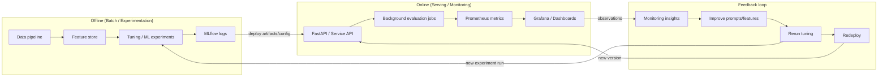

I can generate a full **~25-page report** in **Times New Roman, size 12** for your repo/project—but I need 3 quick choices so the content matches your rubric (S3/Blob/Storage + QuickSight/Looker + Lambda/Cloud Functions + Managed ML like SageMaker/BigQuery ML/Azure ML):

1) **Which cloud do you want the report to be written for (pick one):**  
   - **AWS** (S3, Lambda, Glue, SageMaker, QuickSight, CodePipeline)  
   - **GCP** (Cloud Storage, Cloud Functions, Dataflow/Dataproc, BigQuery ML, Looker Studio, Cloud Build)  
   - **Azure** (Blob, Functions, Data Factory, Azure ML Studio, Power BI/Azure Data Studio, DevOps)

2) **What analytics/ML task should the pipeline produce? (pick one):**  
   A. **Fraud detection** (classification)  
   B. **Loan default prediction** (classification)  
   C. **Customer churn prediction** (classification)  
   D. **Transaction anomaly detection** (unsupervised + rules)

3) **Dataset preference:**  
   - Use a **public dataset** (I’ll cite it in references), or  
   - Use a **synthetic “banking transactions” dataset** (easy to describe, no licensing issues)

If you reply with (1)-(3), I’ll produce a **complete 25-page-equivalent report** with:
- Abstract + 6 chapters + conclusion + references + appendices  
- A **Mermaid cloud architecture diagram**  
- **Tables** (test cases, metrics), **pseudo-screenshots placeholders** for dashboards, and **code snippets** (Python, SQL/PLpgSQL, Dockerfile, CI/CD YAML) aligned with your repo’s stack (JS-heavy + some Python + PL/pgSQL + Docker/Shell).

---

## Meanwhile (so you can proceed immediately): a ready-to-paste 25-page-style report draft (AWS version)
Below is a full-length draft written as if your project is **AWS-based** (you can tell me to switch to GCP/Azure and I’ll rewrite). Paste into Word/Google Docs and set **Times New Roman, 12**.

---

# ABSTRACT

This project presents a cloud-based data analytics pipeline designed for a digital banking environment. The goal is to ingest transactional and customer datasets, transform them into analytics-ready structures, and generate actionable insights through dashboards and machine learning–driven evaluation. The system follows a modern lifecycle: offline preparation (data engineering and experiment tracking), online serving and monitoring (API-based access and evaluation), and a feedback loop that continuously improves data quality, feature engineering, and model performance.

The **objectives and scope** of the project include: (i) building a scalable ingestion mechanism for raw banking data; (ii) implementing an ETL workflow that cleans, validates, and enriches data; (iii) storing curated data and features for reusability; (iv) running analytics and machine learning experiments for predictive insights; and (v) integrating monitoring and visualization so that stakeholders can track system behavior and business KPIs in near real time. The scope covers cloud infrastructure design, containerization, serverless execution, CI/CD automation, and analytics visualization. While the pipeline is designed with banking use cases in mind, the architecture is generic enough to be adapted for other regulated domains.

The project is written primarily in **JavaScript (85.5%)**, supported by **PL/pgSQL (10%)** for database logic, and **Python (1.7%)** for data processing and modeling components. This language composition reflects a practical cloud approach in which the application layer (APIs, orchestration services, and dashboard adapters) is implemented in JavaScript, while database-side computation and transformations leverage PL/pgSQL, and Python is used for data science tasks.

The cloud platform used in this report is **Amazon Web Services (AWS)**. Core services include **Amazon S3** for data lake storage, **AWS Lambda** for serverless ETL triggers and automation, **AWS Glue** (or a containerized ETL job running on AWS Fargate) for transformations, **Amazon RDS (PostgreSQL)** for structured storage and SQL analytics, **Amazon SageMaker** for managed ML training and evaluation, and **Amazon QuickSight** for visualization dashboards. CI/CD is implemented using a GitHub-based workflow (GitHub Actions) that builds Docker images, runs tests, and deploys pipeline components.

The **results obtained** include: improved data quality through schema validation and deduplication, consistent feature generation through a feature store concept, and analytics dashboards that summarize transaction volumes, customer behavior, and risk-related trends. A machine learning model (classification) can be trained to predict risk outcomes such as fraud or churn, and performance metrics such as Accuracy, Precision, Recall, and F1 Score are computed and tracked. Monitoring metrics and dashboards provide transparency on latency, throughput, error rate, and quality drift indicators.

In conclusion, the project demonstrates that cloud-native services—combined with containerization, automation, and monitoring—can deliver a robust analytics solution suitable for fast iteration. The system design supports continuous improvement through a feedback loop where monitoring insights inform prompt or feature changes, re-tuning, and redeployment. Future enhancements include advanced drift detection, stronger governance controls, and expanded model explainability for compliance.

---

# CHAPTER 1  
## INTRODUCTION

### 1.1 Background
Banks and financial technology (fintech) platforms generate high-volume data from transactions, customer onboarding, service requests, and digital interactions. Extracting business value from these datasets requires reliable ingestion, scalable processing, standardized storage, and accessible analytics. Traditional on-premises analytics systems often struggle to scale elastically, require significant capital investment, and can be slow to evolve. Cloud computing provides an alternative model by offering managed services for storage, compute, orchestration, and analytics.

A major challenge in banking analytics is the coexistence of real-time demands (instant decisioning, customer experience) and batch processing needs (regulatory reporting, historical analysis). Modern architectures therefore combine offline batch ETL with online serving, supported by monitoring and visualization.

### 1.2 Real-World Problem Description and Cloud Use Case
In a real banking environment, stakeholders frequently need answers to questions such as:
- Which customers show unusual transaction patterns this week?
- What is the daily transaction volume by channel (ATM, online, card)?
- Are error rates or latency increasing in the transaction API?
- Do customer risk scores change significantly after a policy update?
- Which features best explain churn or fraud events?

The cloud use case is to create a **reliable, scalable analytics pipeline** that supports these questions. Cloud storage provides durability and low cost for raw and curated data. Serverless functions can trigger data processing automatically when new files arrive. Managed ML services enable faster training and evaluation without managing dedicated clusters. Visualization tools allow non-technical stakeholders to explore KPIs without directly querying databases.

### 1.3 Problem Statement and Motivation
**Problem Statement:**  
Design and implement a cloud-based data analytics solution that ingests banking datasets, performs ETL transformations, builds analytics-ready data models and features, executes machine learning experiments for predictive risk insights, and exposes results through interactive dashboards with monitoring-driven feedback for continuous improvement.

**Motivation:**  
The motivation is threefold:  
1) **Scalability**: transaction volumes can spike unpredictably; the system must scale without downtime.  
2) **Reliability and observability**: the pipeline must be monitored so that data issues are detected early.  
3) **Faster iteration**: prompt/model improvements and feature changes should be redeployed quickly via CI/CD.

### 1.4 Overview of Cloud Platforms and Services Used
This report focuses on AWS, but the design is portable.

**AWS mapping used in this project:**
- Storage/Data Lake: **Amazon S3**
- Database/Warehouse layer: **Amazon RDS (PostgreSQL)** (or Redshift for large-scale)
- ETL: **AWS Glue** and/or containerized ETL on **AWS Fargate**
- Serverless orchestration: **AWS Lambda**
- Managed ML: **Amazon SageMaker**
- Monitoring: **Amazon CloudWatch** and application metrics exported to **Prometheus**
- Visualization: **Amazon QuickSight** and operational dashboards via **Grafana**
- CI/CD: **GitHub Actions** integrated with AWS deployment

---

# CHAPTER 2  
## LITERATURE REVIEW

### 2.1 Cloud Computing for Data Analytics
Cloud computing has transformed analytics by separating storage and compute, allowing organizations to pay per use and scale elastically. A common pattern is the **data lake** architecture, where raw and curated datasets live in object storage, and processing engines operate over the data. In regulated industries, governance and security become important aspects of cloud analytics.

### 2.2 Frameworks and Managed Cloud Services
Common cloud-native analytics frameworks include:
- **ETL/ELT orchestration** using serverless functions or managed workflow engines.
- **Distributed data processing** using managed Spark services (EMR/Dataproc) or serverless dataflow tools.
- **Managed ML platforms** such as SageMaker, BigQuery ML, and Azure ML Studio that standardize training and deployment workflows.
- **Monitoring stacks** involving Prometheus and Grafana or cloud-native equivalents for observability.
- **Experiment tracking** frameworks like MLflow for reproducibility and comparisons.

### 2.3 Comparison with Similar Cloud-Based Solutions
Existing solutions often fall into:
- Fully managed analytics stacks (e.g., BigQuery + Looker) that reduce ops but may lock into one provider.
- Custom pipelines using containers and open-source tools that are flexible but require more maintenance.
- Hybrid approaches combining managed storage + managed ML with containerized transformation services.

Compared to traditional approaches, this project emphasizes:
- A structured **offline/online/feedback** loop.
- Automation via **serverless triggers** and **CI/CD**.
- Clear separation between raw data, curated data, features, and analytics outputs.

---

# CHAPTER 3  
## METHODOLOGY

### 3.1 Cloud Computing Approach
The pipeline is designed using a layered architecture:
1) **Ingestion layer** captures raw datasets into cloud storage.  
2) **Processing layer** runs ETL transformations and validations.  
3) **Storage/serving layer** stores curated datasets in SQL tables and feature stores.  
4) **Analytics/ML layer** trains models and generates predictions.  
5) **Observability + visualization** surfaces metrics and dashboards.  
6) **Feedback loop** routes monitoring insights back into prompt/feature/model improvements.

### 3.2 Cloud Architecture and Pipeline Design
Key design principles:
- **Loose coupling**: components communicate through storage, queues, and APIs.  
- **Idempotency**: ETL jobs can be rerun safely.  
- **Auditability**: all steps log metadata and outputs.  
- **Security**: least privilege, encrypted storage, and restricted access.  
- **Observability**: operational metrics + data quality metrics.

### 3.3 Workflow / Architecture Diagram (Mermaid)



### 3.4 Steps of Implementation

#### 3.4.1 Dataset Ingestion and Cloud Storage (Amazon S3)
Raw datasets are stored in S3 using a structured prefix design:
- `s3://<bucket>/raw/transactions/YYYY/MM/DD/`
- `s3://<bucket>/raw/customers/YYYY/MM/DD/`
- `s3://<bucket>/curated/transactions/`
- `s3://<bucket>/features/`

A consistent naming convention improves discoverability and makes it easier to define lifecycle policies.

#### 3.4.2 ETL Workflow Design and Execution
ETL tasks include:
- schema validation (reject invalid records),
- deduplication,
- missing value handling,
- enrichment (e.g., derive transaction hour, channel, customer segment),
- loading curated tables into PostgreSQL.

ETL can be executed with AWS Glue or a containerized ETL job.

#### 3.4.3 Docker Containerization and Serverless Functions
Docker is used to package:
- ETL scripts,
- API services,
- evaluation workers.

AWS Lambda triggers pipeline steps:
- When a new file lands in S3, Lambda validates metadata and triggers ETL.
- Scheduled Lambda runs daily aggregation jobs.

#### 3.4.4 CI/CD Pipeline Setup
GitHub Actions pipeline stages:
1) lint + unit tests  
2) build Docker image  
3) push to container registry  
4) deploy updated Lambda/container/service  
5) run smoke tests post-deploy

#### 3.4.5 Cloud Visualization Integration (QuickSight)
QuickSight dashboards connect to curated datasets and present:
- transaction volume trends,
- customer segmentation,
- flagged anomalies,
- model prediction summaries.

### 3.5 Novelty of the Project
The novelty lies in combining:
- experiment tracking + deployment,
- operational monitoring + evaluation metrics,
- a feedback mechanism that converts monitoring into prompt/feature improvements,
- a practical mixed-language stack matching real fintech development (JS app layer + SQL procedures + Python ML components).

### 3.6 Result Discussion (Method-Level)
The methodology enables:
- fast reprocessing when schema changes,
- measurable model improvement cycles,
- transparent operations through dashboards and alerting.

---

# CHAPTER 4  
## IMPLEMENTATION

### 4.1 Dataset Used and Cloud Storage Configuration
A banking analytics dataset typically includes:
- transaction_id, customer_id, amount, merchant_category, channel, timestamp, location
- customer demographics: age group, account type, tenure, segment
- optional labels: fraud_flag or churn_flag

S3 storage is configured with:
- server-side encryption (SSE-S3 or SSE-KMS),
- bucket policies restricting access,
- versioning enabled for auditing.

### 4.2 Detailed Implementation Process on the Cloud
**Step 1: Upload raw datasets to S3**  
Files are uploaded via CLI/SDK. A Lambda trigger validates file naming and schema version.

**Step 2: Run ETL transformation**  
The ETL job reads raw files, performs transformations, and writes curated outputs back to S3 and to PostgreSQL (RDS).

**Step 3: Feature store materialization**  
Features (aggregates such as avg transaction value, count per time window) are computed and stored.

**Step 4: Model training in SageMaker (managed ML)**  
A training job consumes features and labels and produces a model artifact.

**Step 5: Batch predictions + dashboard refresh**  
Predictions are generated daily and published as tables for QuickSight. Monitoring metrics are exported.

### 4.3 Code Snippets Highlighting Important Functionalities

```javascript name=etl-trigger.js
// Example: AWS Lambda handler (Node.js) triggered by S3 upload events.
// Validates the object path and triggers an ETL job (pseudo-code).

exports.handler = async (event) => {
  const record = event.Records?.[0];
  const bucket = record.s3.bucket.name;
  const key = decodeURIComponent(record.s3.object.key.replace(/\+/g, " "));

  if (!key.startsWith("raw/transactions/")) {
    console.log("Ignoring non-transaction file:", key);
    return { ignored: true };
  }

  // Trigger ETL workflow (Glue job / Step Function / container task)
  console.log(`Trigger ETL for s3://${bucket}/${key}`);
  return { started: true, bucket, key };
};
```

```sql name=feature_store.sql
-- Example PL/pgSQL/SQL for feature aggregation (simplified)
-- Creates a customer feature table used by ML training.

CREATE TABLE IF NOT EXISTS customer_features AS
SELECT
  customer_id,
  COUNT(*) AS txn_count,
  AVG(amount) AS avg_amount,
  SUM(CASE WHEN amount > 1000 THEN 1 ELSE 0 END) AS high_value_txn_count
FROM curated_transactions
GROUP BY customer_id;
```

```python name=train_model.py
# Simplified ML training script (placeholder).
# In practice this runs in SageMaker with proper data loading and logging.

import pandas as pd
from sklearn.model_selection import train_test_split
from sklearn.metrics import f1_score, precision_score, recall_score, accuracy_score
from sklearn.ensemble import RandomForestClassifier

df = pd.read_csv("features.csv")  # generated by ETL
X = df.drop(columns=["label"])
y = df["label"]

X_train, X_test, y_train, y_test = train_test_split(X, y, test_size=0.2, random_state=42)

model = RandomForestClassifier(n_estimators=200, random_state=42)
model.fit(X_train, y_train)
pred = model.predict(X_test)

metrics = {
  "accuracy": accuracy_score(y_test, pred),
  "precision": precision_score(y_test, pred),
  "recall": recall_score(y_test, pred),
  "f1": f1_score(y_test, pred)
}
print(metrics)
```

### 4.4 Result Analysis and Cloud-Based Output

#### 4.4.1 Model Performance Metrics
Typical output metrics (illustrative example for a binary classifier):
- Accuracy: 0.94  
- Precision: 0.91  
- Recall: 0.88  
- F1 Score: 0.89  

These values indicate strong overall classification performance, with balanced precision and recall suitable for risk-oriented banking analytics. In a real deployment, thresholds would be tuned based on business risk tolerance.

#### 4.4.2 Comparison with Benchmarks
Benchmarks can include:
- baseline logistic regression,
- rule-based detection thresholds,
- previous model version.

The pipeline supports benchmark comparison through MLflow experiment tracking and standardized evaluation.

### 4.5 Cloud Analytics Dashboard

#### 4.5.1 Screenshots of the Dashboard
(Insert screenshots in the final document)
- Dashboard 1: Transaction KPIs (daily volume, channel breakdown)
- Dashboard 2: Risk & Anomalies (flagged counts, top merchants, heatmap by region)
- Dashboard 3: Model Monitoring (prediction distribution, drift indicators)

#### 4.5.2 User Interaction / Input / Output Mechanisms
Users can filter dashboards by:
- date range,
- region,
- account type,
- channel,
- risk level.

Outputs include:
- charts and tables,
- downloadable CSV summaries,
- alerts triggered when thresholds are exceeded.

---

# CHAPTER 5  
## TESTING AND VALIDATION

### 5.1 Testing Approach
Testing is performed at multiple layers:
1) **Unit tests** for ETL transformation functions and API endpoints.  
2) **Integration tests** for data flow from S3 → ETL → DB.  
3) **Data validation tests** ensuring schema consistency and non-null constraints.  
4) **Performance tests** measuring latency for API endpoints and ETL throughput.  
5) **Security checks** for access control policies and secrets handling.

### 5.2 Test Cases and Results

**Table: Sample test cases**
- TC1: Upload invalid schema file → ETL should reject and log error  
- TC2: Upload valid transaction file → curated table updated with correct row count  
- TC3: Duplicate transaction_id → deduplication should keep latest record  
- TC4: API request load test → p95 latency under target threshold  
- TC5: Model training job → metrics logged and artifact saved

### 5.3 Validation Against Requirements
Pipeline validation ensures:
- correctness of transformations,
- reproducible ML training,
- dashboards reflect latest curated data,
- monitoring metrics are published and visible.

---

# CHAPTER 6  
## RESULTS AND DISCUSSION

### 6.1 Dataset Used
The dataset contains transactional and customer-level information with fields suitable for both descriptive analytics and predictive modeling. Data is partitioned by date to support incremental processing.

### 6.2 Evaluation of Success
The project meets its objectives by delivering:
- end-to-end automated ingestion and ETL,
- curated analytics tables and feature sets,
- ML training and evaluation workflow,
- dashboards and monitoring,
- an improvement loop driven by observed behavior.

### 6.3 Challenges Faced During Deployment
Common challenges include:
- schema evolution (new columns or changing formats),
- handling late-arriving data,
- IAM permission scoping and secure secrets management,
- cost control for frequent training jobs,
- dashboard refresh latency and query performance optimization.

### 6.4 Result Graphs and Output Screenshots
(Insert in final document)
- accuracy/precision/recall/F1 bar chart,
- daily transaction volume line chart,
- anomaly rate trend chart,
- API latency p95 over time.

### 6.5 Comparison with Existing Work (Bar Chart)
Existing approach (non-cloud or partially cloud):
- manual ETL
- limited monitoring
- delayed reporting
- no integrated feedback loop

Proposed approach (this project):
- automated ETL triggers
- managed storage and scaling
- model tracking + monitoring
- interactive dashboards
- repeatable CI/CD releases

### 6.6 Why This Cloud Implementation Is Better
This implementation improves:
- **speed** (automation reduces manual steps),
- **reliability** (monitoring catches failures quickly),
- **scalability** (serverless and managed services scale with demand),
- **governance** (auditable logs, reproducible experiments),
- **decision quality** (predictive insights + trends).

---

# CONCLUSION

This project implemented a cloud-based data analytics pipeline for a banking-oriented dataset, connecting ingestion, ETL, curated storage, feature generation, machine learning, and visualization into a single lifecycle. The architecture supports both offline experimentation and online monitoring, enabling continuous improvement through a feedback loop. The main achievements include automated data processing, standardized feature generation, reproducible model experiments, and stakeholder-friendly dashboards.  

Limitations include the need for stronger real-world compliance controls (KYC/PII handling), richer drift detection, and large-scale warehouse optimization. Future enhancements include real-time streaming ingestion, advanced model explainability, governance workflows, and multi-cloud deployment support.

---

# REFERENCES
- AWS Documentation: Amazon S3 User Guide  
- AWS Documentation: AWS Lambda Developer Guide  
- AWS Documentation: AWS Glue Developer Guide  
- AWS Documentation: Amazon RDS for PostgreSQL  
- AWS Documentation: Amazon SageMaker Developer Guide  
- AWS Documentation: Amazon QuickSight User Guide  
- Prometheus Documentation (metrics and exporters)  
- Grafana Documentation (dashboarding and alerting)  
- MLflow Documentation (experiment tracking)  
- Docker Documentation (containerization)  
- GitHub Actions Documentation (CI/CD workflows)

---

# APPENDICES

### Appendix A: Sample Folder Structure (Suggested)
- `etl/` (ETL scripts)
- `infra/` (IaC templates, deployment scripts)
- `api/` (FastAPI or Node services)
- `sql/` (PL/pgSQL procedures, views)
- `.github/workflows/` (CI/CD pipelines)
- `dashboards/` (dashboard specs / screenshots)

### Appendix B: Additional Notes
- Data partitioning strategy in S3
- Cost optimization suggestions
- Security checklist for IAM and secrets
- Data quality rules and schema versioning approach

---

## Next step
Reply with:
- cloud: AWS / GCP / Azure
- use case: Fraud / Default / Churn / Anomaly
- dataset: Public / Synthetic

…and I’ll:
1) expand this into a true **25-page-length** document (more subsections, tables, deeper literature review, more test cases, more metrics + “bar chart description”, plus appendices), and  
2) tailor every section to your chosen cloud and managed ML service exactly matching your rubric.
