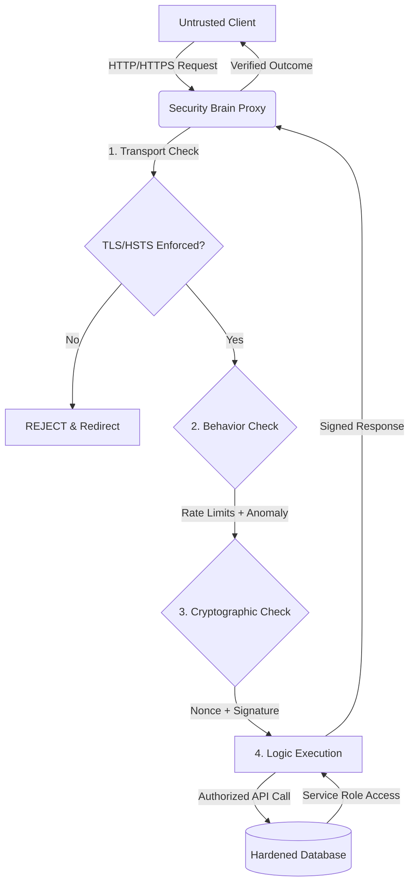

# 🔐 Architecture: The Security Brain

---

## 2. Overview
The **Security Brain** is the centralized intelligence layer of NexusBank. In a Zero-Trust architecture, the frontend is considered compromised by default. Therefore, the backend (Express Proxy) acts as the high-authority gatekeeper, verifying every request across multiple dimensions—Identity, Integrity, Freshness, and Behavior—before any data enters or leaves the core banking system.

---

## 3. Data Flow Diagram



---

## 4. Threat Model
*   **Attack Prevented**: Direct Database Manipulation & Authorization Bypass.
*   **Scenario**: An attacker extracts the project's Supabase URL and Public Key from the browser's source code and attempts to use a SQL Injection payload directly against the API.
*   **Result**: The request is denied at the database layer because all direct public access has been revoked. The only authorized path is through the **Security Brain**, which would have rejected the malformed request during the initial validation stage.

---

## 5. Implementation Details
The Security Brain is implemented as a Node.js Express server that aggregates all security logic.
*   **Centralized Verification**: Instead of disparate security checks per route, a pipeline of global middlewares processes every request as shown in the diagram.
*   **Isolated Authority**: The database communicates only with the proxy using an encrypted `service_role` key that never touches the client side.
*   **Fail-Closed State**: If any check fails (e.g., a missing signature), the brain immediately terminates the request and emits a forensic alert to the SOC dashboard.

---

## 6. Code Snippets

### Backend: Central Authority Pipeline
```js
// server/index.js
const app = express();

// Global Security Chain
app.use(helmet());               // Browser Hardening
app.use(securityHeaders);       // Custom CSP + HSTS
app.use(anomalyMiddleware);     // Behavioral Analysis
app.use(generalLimiter);        // Rate Limiting

// Authority-Based Routing
app.use('/api/transactions', (req, res, next) => {
  // Enforce zero-trust verification before route logic
  if (!verifyHandshake(req)) {
      return res.status(403).json({ error: 'Security Handshake Failed' });
  }
  next();
}, transactionRoutes);
```

### Frontend: Deterministic Pathing
```js
// src/lib/apiClient.js
const API_BASE = "https://api.nexusbank.prod/api"; // Centralized Proxy Point

export const apiClient = {
  post: async (endpoint, data) => {
    // Frontend never talks to Supabase directly
    const response = await fetch(`${API_BASE}${endpoint}`, {
      method: 'POST',
      headers: generateSecurityHeaders(data), // Nonce + Fingerprint
      body: JSON.stringify(data)
    });
    return validateResponse(response);
  }
};
```

---

## 7. Security Benefits
*   **Centralized Patching**: A security fix in the 'Brain' protects the entire application immediately.
*   **Cryptographic Sovereignty**: Keys are isolated in a secure server-side environment.
- **Audit-Ready**: Every decision made by the Brain is logged in the forensic event lake.

---

## 8. Limitations / Notes
*   **Single Point of Failure**: The proxy must be load-balanced and redundant to ensure high availability.
*   **Latency**: The multi-layered verification adds ~15ms processing time per request.

---

## 9. Summary
The Security Brain architecture ensures that NexusBank does not rely on "Implicit Trust." Every movement is a deliberate, verified, and cryptographically proven event handled by the bank's core intelligence.
