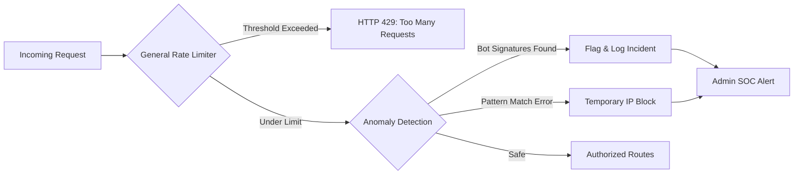

# 🔐 Rate Limiting & Anomaly Detection

---

## 2. Overview
Financial APIs are frequent targets for script-driven attacks. NexusBank uses a tiered Rate Limiting and Behavioral Anomaly Detection system. This ensures that while legitimate users enjoy seamless access, automated bots and brute-force actors are throttled or permanently blocked at the network edge.

---

## 3. Data Flow Diagram



---

## 4. Threat Model
*   **Attack Prevented**: DDoS, Brute-Force, and API Scraping.
*   **Scenario**: A botnet attempts to guess MFA pins by submitting 500 requests per second across different accounts.
*   **Result**: The **General Rate Limiter** blocks individual IPs after 100 requests. Simultaneously, the **Anomaly Engine** detects the high failure rate from the same CIDR range and triggers a global block, protecting the entire account base.

---

## 5. Implementation Details
*   **Dynamic Throttling**: Users are limited to 100 requests per 15-minute window via the `generalLimiter`.
*   **Behavioral Heuristics**: The `anomalyMiddleware` checks for headless browser signatures (e.g., missing User-Agents, automated browser flags).
*   **Tiered Penalty**:
    - **Step 1**: HTTP 429 rejection.
    - **Step 2**: IP metadata logging into `security_events`.
    - **Step 3**: 24-hour CIDR-based firewall rejection for repeated offenders.

---

## 6. Code Snippets

### Backend: Rate Limiter Configuration
```js
// server/middleware/rateLimiter.js
const rateLimit = require('express-rate-limit');

const generalLimiter = rateLimit({
  windowMs: 15 * 60 * 1000, // 15 Minute Window
  max: 100,                  // Max 100 requests
  standardHeaders: true, 
  legacyHeaders: false,
  handler: (req, res) => {
    logger.warn('RATE_LIMIT_EXCEEDED', { ip: req.ip, path: req.path });
    res.status(429).json({
      error: 'Too many requests.',
      retryAfter: '15 minutes'
    });
  }
});
```

### Backend: Anomaly Signature Analysis
```js
// server/middleware/anomaly.js
const anomalyMiddleware = (req, res, next) => {
  const ua = req.headers['user-agent'] || 'MISSING';
  const isBot = /bot|spider|headless|puppeteer/i.test(ua);
  
  if (isBot) {
    // Escalate to Forensic Lake
    alertService.handleSecurityEvent({
      type: 'BOT_ANOMALY',
      severity: 'MEDIUM',
      metadata: { ip: req.ip, ua }
    });
    // In strict mode, we can terminate here
    // return res.status(403).end();
  }
  
  next();
};
```

---

## 7. Security Benefits
*   **Availability Assurance**: Prevents legitimate users from being "starved" of resources by attackers.
*   **Cost Reduction**: Saves database CPU and bandwidth by filtering junk traffic early.
- **Forensic Fingerprinting**: Collects attacker IP/UA metadata before they can attempt a deep exploit.

---

## 8. Limitations / Notes
*   **NAT Issues**: Multiple legitimate users behind a shared IP (Office/Uni) may trigger the limit. Thresholds are calibrated for average human usage.
*   **Distributed Botnets**: Low-frequency distributed attacks require the higher-level Behavior Risk Engine (Doc 13).

---

## 9. Summary
NexusBank filters traffic through a progressive "Sieve" of limits and signatures, ensuring that only genuine human intent reaches the sensitive financial layers.
