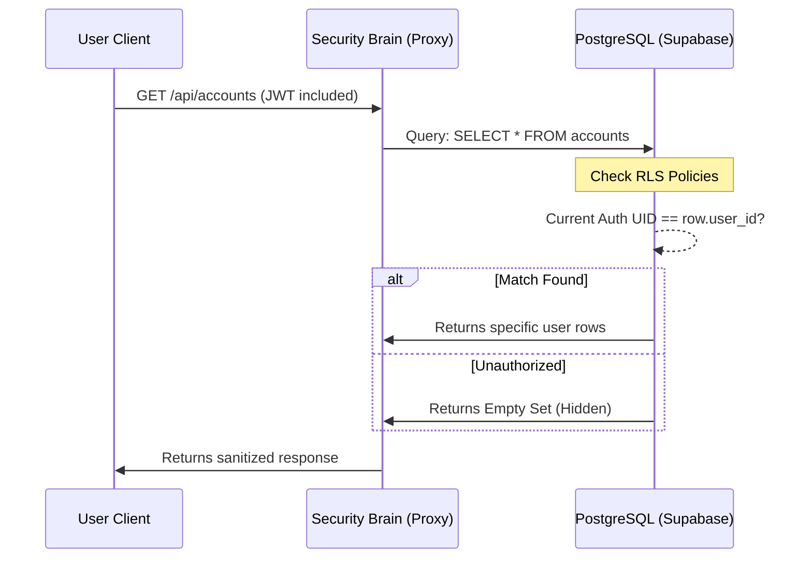

# 🔐 Row-Level Security (RLS) & Database Isolation

---

## 2. Overview
In a multi-tenant banking application, a single database table holds data for every user. **Row-Level Security (RLS)** is a kernel-level PostgreSQL feature that ensures users can only see and modify their own data. Even if a user "hacks" the frontend or intercepts a JWT, the database itself will mathematically refuse to serve data that doesn't belong to them.

---

## 3. Data Flow Diagram



---

## 4. Threat Model
*   **Attack Prevented**: Insecure Direct Object Reference (IDOR) and Horizontal Privilege Escalation.
*   **Scenario**: User A discovers that their profile URL ends in `/profile/123`. They attempt to manually visit `/profile/456` to steal User B's private balance and PAN details.
*   **Result**: The application level might attempt the fetch, but the database policy `USING (auth.uid() = id)` evaluates to `FALSE` for User B's row. The database returns an empty result, making the victim's data invisible to User A.

---

## 5. Implementation Details
*   **Default Deny**: All tables in the `public` schema have RLS enabled by default.
*   **JWT Context Binding**: Supabase automatically injects the `auth.uid()` of the authenticated user into the PostgreSQL session context.
*   **Admin Overlays**: Special policies allow `admin` roles to bypass isolation for forensic surveillance (Doc 19).

---

## 6. Code Snippets

### SQL: Hardened Table Policies
```sql
-- Enforce RLS on sensitive financial tables
ALTER TABLE public.accounts ENABLE ROW LEVEL SECURITY;

-- 1. Standard Policy: Owner-Only Access
CREATE POLICY "Users can only view their own accounts" 
ON public.accounts FOR SELECT 
USING (auth.uid() = user_id);

-- 2. Restrictive Policy: No direct public insert
CREATE POLICY "Strict isolated creation" 
ON public.accounts FOR INSERT 
WITH CHECK (auth.uid() = user_id);

-- 3. Admin Oversight (Forensic Path)
CREATE POLICY "Admins can view all for audit" 
ON public.accounts FOR SELECT 
USING (
  EXISTS (
    SELECT 1 FROM public.profiles 
    WHERE id = auth.uid() AND role = 'admin'
  )
);
```

---

## 7. Security Benefits
*   **Kernel-Level Enforcement**: Protection resides in the data layer (the most persistent layer).
*   **Elimination of IDOR**: Developers no longer need to manually add `.eq('user_id', myId)` to every query; the DB handles it automatically.
- **Fail-Safe**: If the application layer is ever compromised, the attacker is still "caged" within their own account's data.

---

## 8. Limitations / Notes
*   **Join Optimization**: Complex RLS policies can impact query performance if they involve nested subqueries.
*   **Direct Access Bypass**: RLS can be bypassed by the `service_role` (Backend Secret), which is why that key must never reach the client (Doc 18).

---

## 9. Summary
RLS is NexusBank's "Final Wall." It ensures that data isolation is not a suggestion, but a fundamental law of the database engine, providing an unbreakable guarantee of user privacy.
