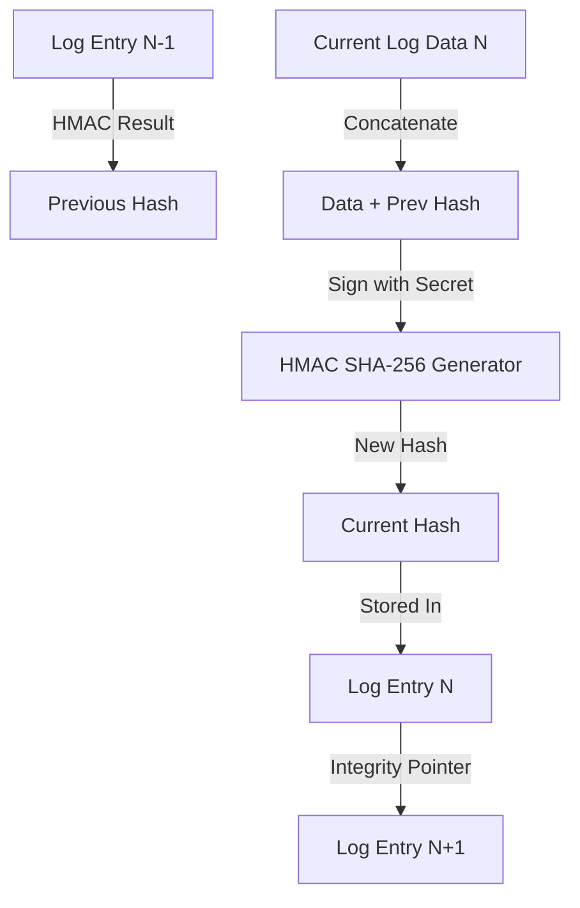

# 🔐 Audit Hash Chaining (Forensic Immutability)

---

## 2. Overview
Logs are the only record of "what happened" in a security incident. In a high-stakes banking environment, an attacker's first goal is to delete those logs. **Audit Hash Chaining** makes this impossible. By cryptographically linking every log entry to the one before it, NexusBank creates an immutable forensic record that cannot be modified without breaking the entire chain.

---

## 3. Data Flow Diagram



---

## 4. Threat Model
*   **Attack Prevented**: Forensic Scrubbing and History Manipulation.
*   **Scenario**: A compromised administrator executes a fraudulent transfer and then tries to hide their tracks by deleting the entry from the `security_events` table.
*   **Result**: Deleting Entry N breaks the pointer chain for Entry N+1. The **Shadow Ledger Job (Doc 12)** performs a continuous "Walking Audit" of the hashes. It detects that `Hash(N-1) + Data(N)` no longer exists, identifying a "Chain Breach" and triggering a critical system-wide lock.

---

## 5. Implementation Details
*   **Cryptographic Anchoring**: Every log includes its own payload + the unique hash of the preceding entry.
*   **HMAC Signing**: All hashes are generated using a hardware-protected `AUDIT_SECRET`.
*   **Non-Repudiation**: Because each entry is linked to the previous one, the presence of a valid "latest" hash proves the existence and integrity of every single preceding record.

---

## 6. Code Snippets

### Backend: Creating a Chained Record
```js
// server/services/alertService.js
const crypto = require('crypto');

async function logChainedEvent(eventData) {
  // 1. Fetch the hash of the latest existing entry
  const { data: latest } = await supabaseAdmin
    .from('security_events')
    .select('event_hash')
    .order('created_at', { ascending: false })
    .limit(1);

  const previousHash = latest?.[0]?.event_hash || 'GENESIS_BLOCK';

  // 2. Prepare Payload
  const payload = JSON.stringify(eventData);
  const dataToSign = `${payload}:${previousHash}`;

  // 3. Generate HMAC SHA-256
  const currentHash = crypto
    .createHmac('sha256', process.env.AUDIT_SECRET)
    .update(dataToSign)
    .digest('hex');

  // 4. Save to Immutable Table
  return supabaseAdmin.from('security_events').insert([{
    ...eventData,
    event_hash: currentHash,
    previous_hash: previousHash
  }]);
}
```

---

## 7. Security Benefits
*   **Provable History**: Mathematical proof that the sequence of events is accurate.
*   **Tamper Evidence**: Any modification (bit-flipping) in a historical record changes its hash, which invalidates the current record.
- **Audit Speed**: Integrity can be verified in a single pass over the database.

---

## 8. Limitations / Notes
*   **Secret Security**: If the `AUDIT_SECRET` is leaked, an attacker could technically "re-chain" the logs (though this is extremely difficult in real-time).
*   **Storage Overhead**: Adding hashes to every row increases database storage requirements by ~15-20%.

---

## 9. Summary
Audit Hash Chaining ensures that NexusBank's memory is absolute. It removes the "human element" from log management, replacing trust with a verifiable cryptographic chain.
