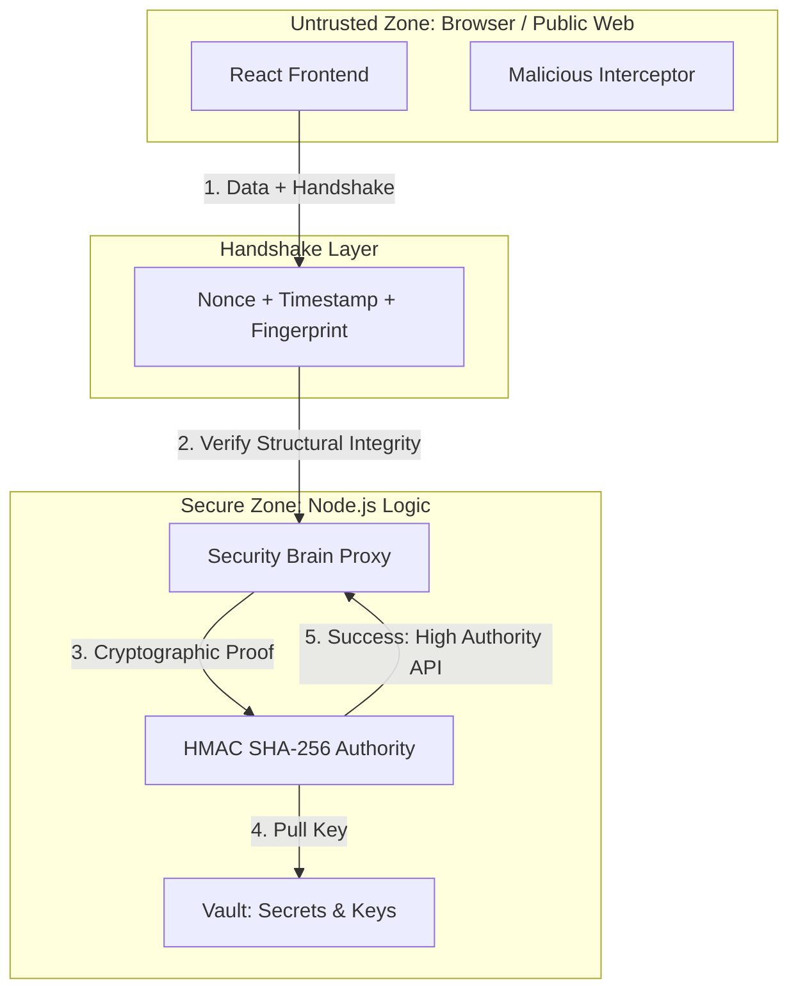

# 🔐 Zero-Trust Cryptography (Philosophy)

---

## 2. Overview
NexusBank operates on the principle of **Zero-Trust**: No identity, system, or network is trusted by default. Even after a user is authenticated, every subsequent request is treated as a distinct transaction that must prove its own cryptographic integrity and freshness. This document outlines the cryptographic primitives used to enforce this "Never Trust, Always Verify" philosophy.

---

## 3. Trust Boundary Diagram



---

## 4. Threat Model
*   **Attack Prevented**: Symmetric Secret Leakage and Implicit Authorization.
*   **Scenario**: An attacker performs a "View Source" on the frontend bundle to extract the bank's transaction keys.
*   **Result**: The attacker finds **zero secrets**. Because NexusBank uses a Zero-Trust approach, all signing and cryptographic verification happen exclusively on the server. The frontend only acts as a validator of the server's signed responses (Doc 15).

---

## 5. Implementation Details
*   **Decoupled Trust**: The frontend does not "Authorize" transactions; it "Requests" them with metadata.
*   **Mandatory Provenance**: Every mutation request (POST/PUT) must include:
    - **Freshness**: A timestamp within a 60-second window.
    - **Uniqueness**: A single-use nonce provided by a server challenge.
    - **Identity Binding**: A cryptographic device fingerprint.
*   **Fail-Closed Integrity**: If any component of the cryptographic bundle is missing or invalid, the request is purged, and the user's session is terminated.

---

## 6. Code Snippets

### Backend: Zero-Trust Verification Engine
```js
// server/lib/security.js
const crypto = require('crypto');

/**
 * Validates the Zero-Trust handshake of an incoming request.
 */
function verifyZeroTrustHandshake(req) {
    const { signature, nonce, timestamp } = req.body;
    const clientFingerprint = req.headers['x-fingerprint'];

    // 1. Mandatory Metadata Presence
    if (!signature || !nonce || !timestamp || !clientFingerprint) {
        return { valid: false, reason: 'MISSING_TRUST_METADATA' };
    }

    // 2. Freshness Verification (Drift < 60s)
    if (Math.abs(Date.now() - timestamp) > 60000) {
        return { valid: false, reason: 'REQUEST_EXPIRED' };
    }

    // 3. Authority Validation (Re-calculate HMAC)
    const expectedSignature = generateInternalSignature(req.body);
    if (signature !== expectedSignature) {
        return { valid: false, reason: 'SIGNATURE_MISMATCH' };
    }

    return { valid: true };
}
```

---

## 7. Security Benefits
*   **Minimized Attack Surface**: The bank's core logic is "invisible" to the public web until a valid handshake is proven.
*   **Resilience to Phishing**: Stolen passwords alone are insufficient to move money without the associated cryptographic device binding.
- **End-to-End Verification**: Guarantees that the users' intent and the backend's execution are perfectly aligned.

---

## 8. Limitations / Notes
*   **Synchronization**: Requires high-accuracy NTP synchronization for the 60s time window.
*   **User Friction**: Initial handshakes (fetching nonces) add a slight delay to the first transaction of a session.

---

## 9. Summary
Zero-Trust Cryptography is the "DNA" of NexusBank. It ensures that the system's security is derived from mathematical proofs rather than the perceived safety of an authenticated session.
