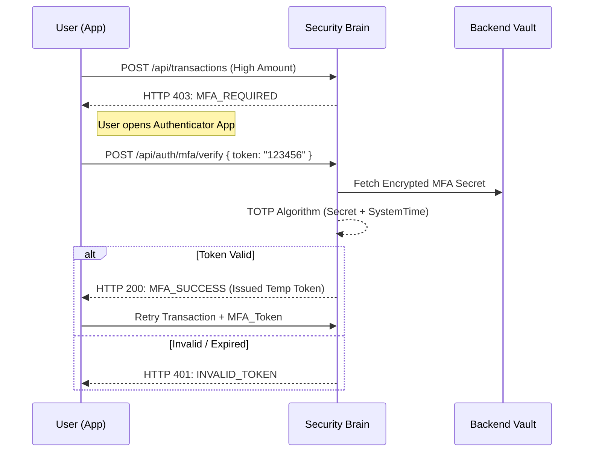

# 🔐 MFA & TOTP Authentication

---

## 2. Overview
Traditional passwords are the single most common failure point in security. NexusBank implements **Multi-Factor Authentication (MFA)** using the **TOTP (Time-based One-Time Password)** standard (RFC 6238). By requiring a second factor generated on a physical device, we ensure that compromised credentials are insufficient to execute high-value financial operations.

---

## 3. Handshake Diagram



---

## 4. Threat Model
*   **Attack Prevented**: Credential Stuffing, Phishing, and Account Takeover.
*   **Scenario**: An attacker obtains a user's password from a third-party breach and successfully logs into the bank's frontend.
*   **Result**: The attacker attempts to transfer ₹50,000. The **Behavior Risk Engine (Doc 13)** identifies the transaction as high-risk. The system triggers an "MFA Step-Up." Since the attacker does not have the user's physical phone, they cannot provide the 6-digit code, and the transaction is aborted.

---

## 5. Implementation Details
*   **TOTP Standard**: Uses a 30-second window for code rotation.
*   **Step-Up Strategy**: MFA is not required for daily balance checks but is mandated for:
    - Transactions above a specific risk threshold.
    - Password or Email changes.
    - Logins from unrecognized device fingerprints.
*   **Encrypted Secrets**: MFA secrets are stored in the database using AES-256 encryption, never visible even to database admins.

---

## 6. Code Snippets

### Backend: TOTP Verification Logic
```js
// server/services/authService.js
const { authenticator } = require('otplib');

/**
 * Verifies a TOTP token against a user's secret.
 */
async function verifyMfaToken(userId, userToken) {
  // 1. Fetch the encrypted secret from the vault
  const { data: user } = await supabaseAdmin
    .from('profiles')
    .select('mfa_secret')
    .eq('id', userId)
    .single();

  if (!user || !user.mfa_secret) return false;

  // 2. Validate using the RFC 6238 implementation
  // No step-back/forward window for high-value banking security
  const isValid = authenticator.check(userToken, user.mfa_secret);

  if (!isValid) {
    logger.warn('MFA_FAILURE', { userId, timestamp: new Date() });
    return false;
  }

  return true;
}
```

---

## 7. Security Benefits
*   **Identity Pinning**: Ties the account to a physical "Something You Have."
*   **Dynamic Security**: Allows for friction-less daily use with high-friction protection for critical moments.
- **Phishing Resistance**: TOTP codes expire quickly, making them difficult to use in automated phishing proxies.

---

## 8. Limitations / Notes
*   **Clock Sync**: Requires the server and the user's phone to be in sync. Large time drifts will cause failures.
*   **Recovery Complexity**: Users who lose their device require a manual, high-verification forensic recovery process (Doc 25).

---

## 9. Summary
MFA is the "Hard Identification" layer of NexusBank. It ensures that even in the event of a total credential compromise, the bank's core assets remain protected behind a physical cryptographic barrier.
