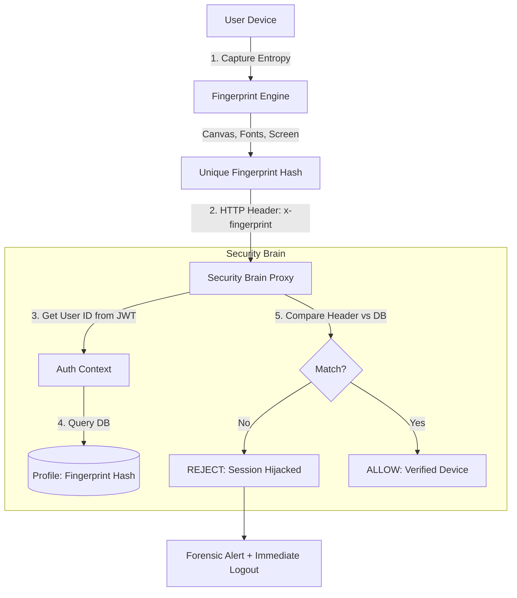

# 🔐 Session Binding & Device Fingerprinting

---

## 2. Overview
Session hijacking occurs when an attacker steals a user's session token (JWT) and uses it to impersonate them. NexusBank defends against this by "binding" every session to a specific, unique **Device Fingerprint**. This ensures that a hijacked token is useless unless the attacker also perfectly replicates the victim's hardware and software environment.

---

## 3. Architecture Diagram



---

## 4. Threat Model
*   **Attack Prevented**: Token Theft (XSS/Proxy) and Session Persistence.
*   **Scenario**: An attacker steals a user's active session cookie from a public computer and attempts to paste it into their own browser at home.
*   **Result**: The attacker's browser has a different screen resolution, installed fonts, and GPU renderer. The generated `x-fingerprint` is different. The **Security Brain** detects the mismatch, invalidates the stolen token, and triggers a critical security alert.

---

## 5. Implementation Details
*   **Entropy Collection**: The frontend uses a non-intrusive collection of 20+ browser attributes (e.g., color depth, hardware concurrency).
*   **Binding Moment**: The fingerprint is associated with the user account during the initial login/MFA handshake.
*   **Strict Verification**: Every single API request is vetted against the stored fingerprint before the request body is even parsed.
*   **Fail-Closed**: A fingerprint mismatch on a financial route triggers an immediate system logout and a persistent block on the session ID.

---

## 6. Code Snippets

### Frontend: Gathering Device Entropy
```js
// src/utils/security.js
export const generateFingerprint = () => {
  const meta = {
    ua: navigator.userAgent,
    res: `${window.screen.width}x${window.screen.height}`,
    depth: window.screen.colorDepth,
    tz: Intl.DateTimeFormat().resolvedOptions().timeZone,
    mem: navigator.deviceMemory || 0,
    cpu: navigator.hardwareConcurrency || 0
  };
  
  // Convert to SHA-256 for the header
  return sha256(JSON.stringify(meta));
};
```

### Backend: Enforcing the Binding
```js
// server/middleware/anomaly.js
const verifyDeviceBinding = async (req, res, next) => {
    const activeFingerprint = req.headers['x-fingerprint'];
    const userId = req.user?.id;

    if (userId && activeFingerprint) {
        const { data: profile } = await supabaseAdmin
            .from('profiles')
            .select('fingerprint_hash')
            .eq('id', userId)
            .single();

        if (profile?.fingerprint_hash && profile.fingerprint_hash !== activeFingerprint) {
            logger.error('SESSION_BINDING_VIOLATION', { userId, ip: req.ip });
            
            // Terminate compromised session
            await supabaseAdmin.from('active_sessions').delete().eq('user_id', userId);
            
            return res.status(403).json({ 
                error: 'Unauthorized environment. Please log in again.' 
            });
        }
    }
    next();
};
```

---

## 7. Security Benefits
*   **Token Isolation**: JWTs are no longer "Bearer" tokens; they are "Device-Locked" tokens.
*   **Reduced XSS Impact**: Even if a script steals a token, it cannot use it from an external server.
- **Improved Anomaly Detection**: Changes in fingerprints serve as high-utility signals for detecting fraudulent activity.

---

## 8. Limitations / Notes
*   Fingerprints can change after browser updates or if the user connects an external monitor.
*   Advanced attackers may attempt to spoof the `User-Agent` and other headers if they know the victim's hardware.

---

## 9. Summary
Device Fingerprinting adds a layer of "Hardware Identity" to the digital session, ensuring that NexusBank sessions are literally tethered to the physical device authorized by the user.
