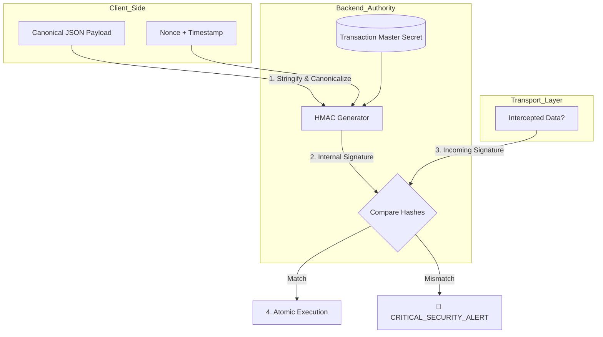

# 🔐 Transaction HMAC Integrity (Cryptographic Signing)

---

## 2. Overview
Financial transactions are the ultimate target for attackers. A "Man-in-the-Middle" (MITM) attacker might try to intercept a request and change the destination account or the amount. NexusBank prevents this using **HMAC-SHA256 (Hash-based Message Authentication Code)**. Every transaction payload is cryptographically signed, ensuring that if even one bit of the transaction data is altered, the entire request is rejected by the server.

---

## 3. Data Integrity Diagram



---

## 4. Threat Model
*   **Attack Prevented**: Request Tampering and Message Injection.
*   **Scenario**: An attacker performs a "Man-in-the-Browser" attack. When the user sends ₹1,000 to "Account-Safe," the attacker's script intercepts the AJAX request and changes the body to ₹100,000 to "Account-Attacker."
*   **Result**: The server receives the modified payload. It re-calculates the HMAC using the `TRANSACTION_MASTER_SECRET`. Because the "Amount" and "Recipient" fields have changed, the resulting hash is completely different. The server detects the integrity breach, stops the transaction, and locks the user's account for forensic review.

---

## 5. Implementation Details
*   **Canonicalization**: JSON payloads can vary (spaces, key order). NexusBank "Canonicalizes" the object by sorting keys alphabetially before hashing, ensuring the signature is always deterministic.
*   **Master Secret Isolation**: The key used for signing never leaves the server's memory.
*   **Chained Validation**: The signature is combined with the `nonce` and `timestamp` to prevent replay attacks simultaneously (Doc 23).

---

## 6. Code Snippets

### Backend: The Integrity Engine
```js
// server/services/transactionService.js
const crypto = require('crypto');

/**
 * Validates the absolute integrity of a transaction payload.
 */
function validateTransactionIntegrity(payload, incomingSignature) {
    // 1. Canonicalize the payload (Deterministic Key Order)
    const canonicalPayload = JSON.stringify(
      Object.keys(payload).sort().reduce((acc, key) => {
        if (key !== 'signature') acc[key] = payload[key];
        return acc;
      }, {})
    );

    // 2. Generate the Source of Truth HMAC
    const expectedSignature = crypto
        .createHmac('sha256', process.env.TRANSACTION_MASTER_SECRET)
        .update(canonicalPayload)
        .digest('hex');

    // 3. Constant-time comparison to prevent timing attacks
    return crypto.timingSafeEqual(
        Buffer.from(incomingSignature, 'hex'),
        Buffer.from(expectedSignature, 'hex')
    );
}
```

---

## 7. Security Benefits
*   **Non-Repudiation**: Proves that the data recorded in the ledger is exactly what the authorized user intended.
*   **Tamper Evidence**: Provides immediate detection of intercepted or modified data.
- **End-to-End Safety**: Protects the transaction during its most vulnerable state (transit over the public web).

---

## 8. Limitations / Notes
*   Requires the client and server to agree on a strict canonicalization algorithm.
*   Does not protect against the theft of the User's credentials (handled by MFA).

---

## 9. Summary
Transaction HMAC Integrity is the "Envelope Seal" of NexusBank. It guarantees that the movement of money is a pristine, unalterable event, ensuring that the ledger remains a source of perfect financial truth.
