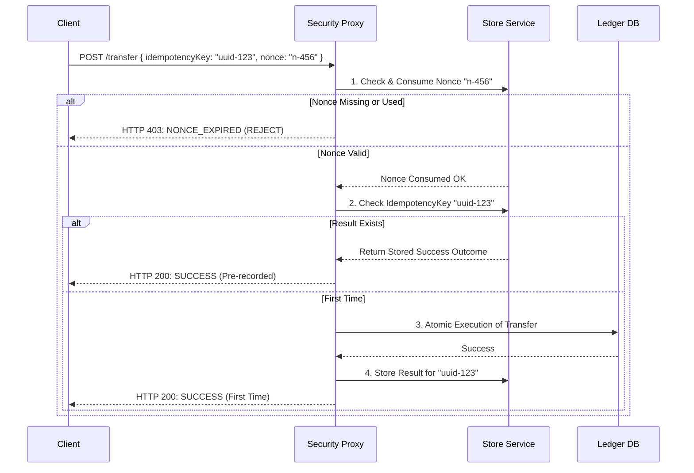

# 🔐 Idempotency & Nonce Protection

---

## 2. Overview
In banking systems, the "At-Most-Once" delivery guarantee is non-negotiable. A user clicking "Send" twice due to a slow UI or a network retry should never result in two separate withdrawals. NexusBank ensures transaction uniqueness through a dual defensive layer: **Single-Use Nonces** (to prevent accidental/malicious duplication) and **Server-Side Idempotency Keys** (to ensure consistent results for the same intent).

---

## 3. Request Lifecycle Diagram



---

## 4. Threat Model
*   **Attack Prevented**: Double-Spending and Replay Attacks.
*   **Scenario (Double-Spend)**: A user has ₹1,000. They rapidly click the "Pay" button five times. The network is slow, so five identical HTTP requests arrive at the server almost simultaneously.
*   **Result**: 
    1.  The first request consumes the **Nonce** and proceeds to execute.
    2.  The next four requests are immediately rejected by the **Security Proxy** because the Nonce they carried is already marked as "Used."
    3.  If the user's browser retries the *same* request (same Idempotency Key) after a timeout, the server returns the cached success message without debiting the account again.

---

## 5. Implementation Details
*   **Nonce Consumption**: This is an atomic "Check-and-Delete" operation. A nonce is invalidated milliseonds before the transaction logic begins.
*   **Idempotency Key**: A client-generated UUID that uniquely identifies a specific transaction intent.
*   **Storage Hierarchy**:
    - **Nonces**: Stored in high-speed RAM (Short TTL: 60s).
    - **Idempotency Keys**: Persisted in the database or Redis (Long TTL: 24h).

---

## 6. Code Snippets

### Backend: Consuming the Nonce
```js
// server/routes/transactions.js
router.post('/transfer', async (req, res) => {
    const { nonce, idempotencyKey } = req.body;
    const userId = req.user.id;

    // 1. Atomic Verification & Invalidation
    const isValid = storeService.consumeNonce(userId, nonce);
    if (!isValid) {
        return res.status(403).json({ error: 'Duplicate or Invalid Nonce' });
    }

    // 2. Check for Previous Success
    const previousResult = await storeService.getIdempotencyResult(idempotencyKey);
    if (previousResult) {
        return res.json(previousResult);
    }

    // ... Transaction Logic ...

    // 3. Mark Intent as Fulfilled
    storeService.saveIdempotency(idempotencyKey, { status: 'SUCCESS', amount: req.body.amount });
});
```

---

## 7. Security Benefits
*   **Accidental Prevention**: Protects users from UI lags leading to extra costs.
*   **Replay Resilience**: Makes intercepted requests useless as they cannot be successfully resubmitted.
- **Deterministic Outcomes**: Guarantees that the user's intent is recorded exactly once in the ledger.

---

## 8. Limitations / Notes
*   Requires a highly available storage engine (like Redis) for nonce state; if the storage fails, the system might "fail-closed" and block all transfers.
*   The client must generate a new Idempotency Key only for a *new* intent, not for a retry.

---

## 9. Summary
By combining Nonces and Idempotency Keys, NexusBank creates an "At-Most-Once" execution environment, ensuring financial stability and protecting against both user error and malicious replay attempts.
