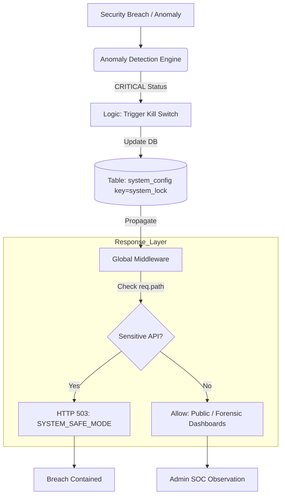

# 🔐 Kill Switch & Safe Mode (Emergency Containment)

---

## 2. Overview
When a serious security breach or ledger anomaly is detected, every second counts. NexusBank implements a **Global Kill Switch** and a "Safe Mode" architecture. This allows the system to automatically or manually paralyze all high-privilege financial operations while maintaining administrative visibility, effectively putting the bank into "Stasis" to prevent further damage.

---

## 3. Containment Logic Diagram



---

## 4. Threat Model
*   **Attack Prevented**: Automated Draining of Funds and 0-Day Logic Exploits.
*   **Scenario**: A catastrophic vulnerability is discovered that allows users to bypass authorization for transfers. A bot begins draining ₹100 from 10,000 accounts.
*   **Result**: The **Shadow Ledger (Doc 12)** detects the rapid imbalance. It programmatically triggers the `activateSystemLock`. Within milliseconds, the `killSwitch` middleware across all API nodes begins rejecting all transfers. The breach is halted, and only ₹5,000 is lost instead of ₹1,000,000.

---

## 5. Implementation Details
*   **Persistent State**: The lock is stored in the database (`system_config`), ensuring that if the server restarts during an attack, it reboots into "Safe Mode."
*   **Non-Transparent Failure**: Users receive a clear 503 error, ensuring the service doesn't appear "broken" but rather "under maintenance."
*   **Bypass Privilege**: The Admin Dashboard (SOC) is explicitly whitelisted from the Kill Switch so security teams can investigate the state of the system while it's locked.

---

## 6. Code Snippets

### Backend: The Lockdown Middleware
```js
// server/middleware/killSwitch.js
const { supabaseAdmin } = require('../lib/supabaseAdmin');

const killSwitch = async (req, res, next) => {
  // 1. Fetch live system state (Cache for 5s in production)
  const { data: config } = await supabaseAdmin
    .from('system_config')
    .select('value')
    .eq('key', 'system_lock')
    .single();

  if (config?.value?.active) {
    // 2. Allow administrative recovery path
    if (req.path.startsWith('/api/admin')) return next();

    // 3. Deny all financial mutations
    logger.warn('SYSTEM_LOCK_ACTIVE: BLOCKING_REQUEST', { path: req.path });
    return res.status(503).json({
      error: 'Safe Mode Active',
      reason: config.value.reason || 'Security Maintenance'
    });
  }
  next();
};
```

---

## 7. Security Benefits
*   **Blast Radius Control**: Caps the potential damage of a successful exploit.
*   **Forensic Stability**: Freezes the system state, making it easier to analyze memory and database logs without ongoing changes.
- **Fail-Safe Integrity**: Prioritizes the safety of the total bank assets over 100% application uptime.

---

## 8. Limitations / Notes
*   **Indiscriminate**: Safe Mode locks out 100% of standard users, regardless of whether they are under attack.
*   **DB Dependency**: If the database itself is fully down, the middleware may fail to detect the lock (handled by "Fail-Closed" defaults).

---

## 9. Summary
The Global Kill Switch is NexusBank's "Emergency Brake." It ensures that even when the system's logic is compromised, the base financial assets remain immobile and protected.
