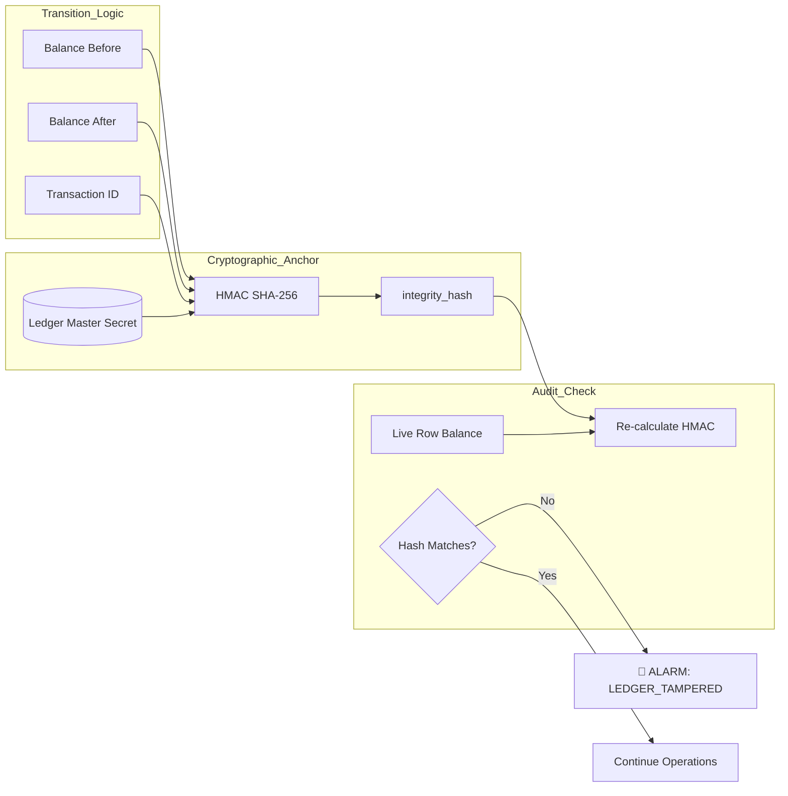

# 🔐 Ledger Integrity Hashing (Balance Guard)

---

## 2. Overview
The final defense in a banking system is the integrity of the balance itself. NexusBank implements **Ledger Integrity Hashing** to detect direct database manipulation. Every time a user's balance shifts, the system signs the "before" and "after" state of the account. If an attacker updates a balance directly in SQL without going through the authorized logic, the hash check will fail, and the account will be immediately locked.

---

## 3. Verification Diagram



---

## 4. Threat Model
*   **Attack Prevented**: SQL Injection Balance Injection and Bit-Flipping.
*   **Scenario**: An attacker gains internal database access and updates their `balance` from ₹1,000 to ₹10,000,000.
*   **Result**: The next time the user attempts a legitimate transaction, the `transactionService` re-calculates the `integrity_hash` using the current live balance. Because the balance was changed without the `LEDGER_SECRET`, the hash does not match the one stored in the last transaction record. The account enters a "Compromised" state, and the transaction is aborted.

---

## 5. Implementation Details
*   **Concatenated State**: The hash is derived from `userId + balanceBefore + balanceAfter + txnId`.
*   **Atomic Notarization**: The hash is saved as a column in the `transactions` table, effectively notarizing the new state of the user's wealth.
*   **Continuous Verification**: The **Shadow Ledger (Doc 12)** performs background sweeps, re-verifying these hashes for all active users every hour.

---

## 6. Code Snippets

### Backend: Notarizing a Balance Shift
```js
// server/services/transactionService.js
const crypto = require('crypto');

async function notarizeBalance(userId, oldBalance, newBalance, txnId) {
    // 1. Create unique integrity payload
    const payload = `${userId}:${oldBalance}:${newBalance}:${txnId}`;

    // 2. Sign with isolated Master Secret
    const integrityHash = crypto
        .createHmac('sha256', process.env.LEDGER_MASTER_SECRET)
        .update(payload)
        .digest('hex');

    // 3. Update the transaction record for future verification
    await supabaseAdmin
        .from('transactions')
        .update({ balance_integrity_hash: integrityHash })
        .eq('id', txnId);
}
```

---

## 7. Security Benefits
*   **Insider Threat Mitigation**: Even a rogue DBA cannot change balances without detection.
*   **Atomic Accuracy**: Ensures that every ledger movement is mathematically consistent with the account total.
- **Forensic Confidence**: Provides proof that the current state of a user's funds is the result of authorized transactions only.

---

## 8. Limitations / Notes
*   **Initial State**: Does not protect against an attacker injecting money during the initial account creation (Genesis).
*   **Performance**: Adds one extra hashing operation to the transaction cycle.

---

## 9. Summary
Ledger Integrity Hashing is the "Final Signature" of NexusBank. It ensures that money can only be moved through the front door, making the database a verifiable record of truth rather than a simple scratchpad of numbers.
