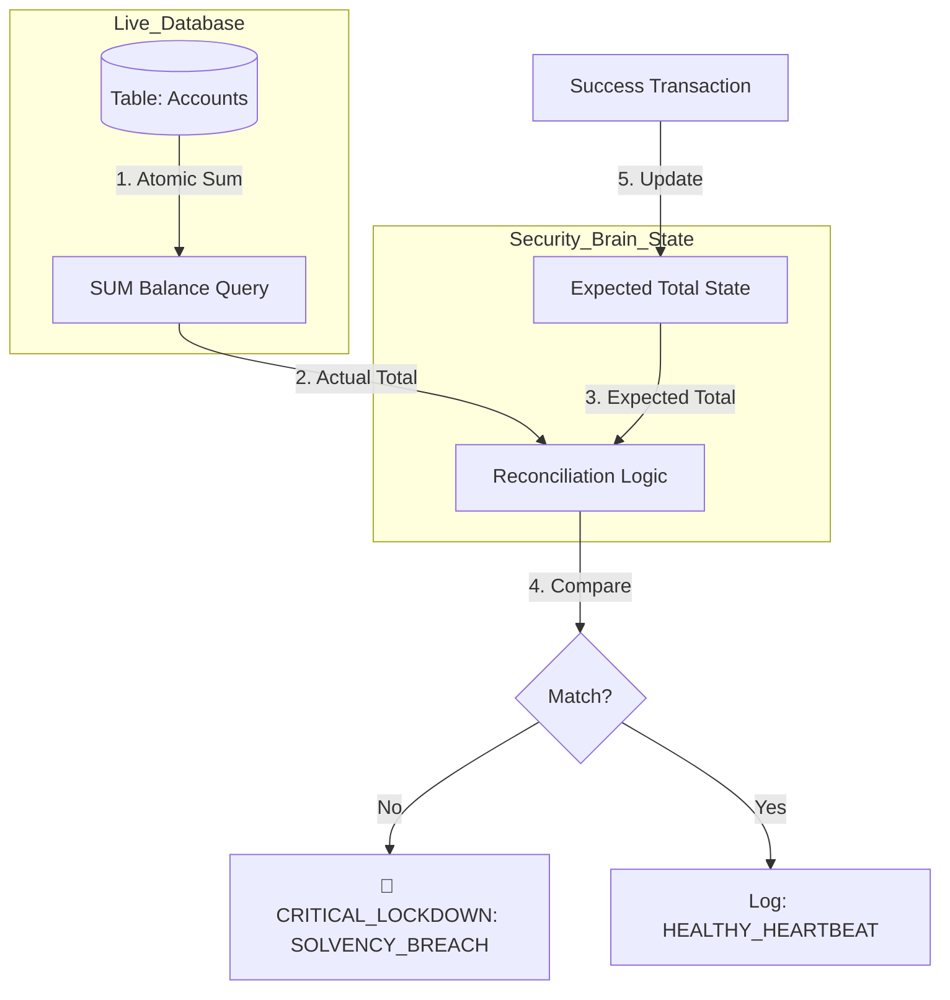

# 🔐 Shadow Ledger Verification (Background Integrity)

---

## 2. Overview
The **Shadow Ledger** is the bank's automated background auditor. Even if transaction-level hashing (Doc 11) is bypassed by a sophisticated zero-day exploit, the Shadow Ledger acts as the final "Safety Net." It continuously reconciles the total pool of actual money in the database against a cryptographically cached "Expected Total." If the sum of all accounts differs by even a single rupee from the expected state, the system triggers a platform-wide lockdown.

---

## 3. Reconciliation Diagram



---

## 4. Threat Model
*   **Attack Prevented**: Hidden Fraud, Multi-Accounting Exploits, and Atomic Race Conditions.
*   **Scenario**: An attacker discovers a race condition where they can credit themselves ₹10,000 without a corresponding debit from another account. Each individual transaction record might look valid, but the "Total Bank Balance" has risen.
*   **Result**: The **Shadow Ledger** running on a 30-second interval performs a `SUM()` of the entire database. It detects that the actual total is ₹10,000 higher than the `Expected Total` (which only increments on verified successes). It identifies a "Creation of money out of thin air" and immediately activates the **Kill Switch (Doc 10)**.

---

## 5. Implementation Details
*   **Atomic Snapshots**: Reconciliation is performed as an atomic database scan.
*   **Delta Tracking**: The `Expected Total` is updated exclusively by the high-authority `transactionService` after a successful atomic commit.
- **Fail-Fast Containment**: The detection triggers a `SYSTEM_LOCK` immediately, bypassing standard alert queues.

---

## 6. Code Snippets

### Backend: The Audit Loop
```js
// server/services/ledgerAudit.js
class ShadowLedger {
    constructor() {
        this.expectedTotal = 0; // Load from Genesis on boot
    }

    async runReconciliation() {
        // 1. Perform atomic scan of the live ledger
        const { data: accounts, error } = await supabaseAdmin
            .from('accounts')
            .select('balance');

        const actualTotal = accounts.reduce((sum, acc) => sum + acc.balance, 0);

        // 2. Cross-Verify Solvency
        if (actualTotal !== this.expectedTotal) {
            logger.error('🚨 SYSTEM_SOLVENCY_INCONSISTENCY', {
              expected: this.expectedTotal,
              actual: actualTotal,
              drift: actualTotal - this.expectedTotal
            });

            // Trigger the absolute emergency response
            await alertService.activateSystemLock('LEDGER_DISCREPANCY_DETECTED', { 
                drift: actualTotal - this.expectedTotal 
            });
            return false;
        }

        logger.info('LEDGER_RECONCILIATION_HEALTHY', { actualTotal });
        return true;
    }

    // Called only by authorized transaction success
    updateExpectedTotal(delta) {
        this.expectedTotal += delta;
    }
}
```

---

## 7. Security Benefits
*   **Macro-Integrity**: Protections that cover the entire bank, not just individual users.
*   **Detection of Stealth Attacks**: Identifies exploits that don't rely on tampering with existing records but involve adding new, fake data.
- **Regulatory Proof**: Provides a 100% accurate proof of solvency for government auditors.

---

## 8. Limitations / Notes
*   **Performance**: On systems with millions of users, `SUM()` queries must be optimized via materialized views or separate aggregation tables.
*   **Floating Point**: NexusBank uses `Int` (Paisa) for all calculations to avoid IEEE 754 precision drift.

---

## 9. Summary
Shadow Ledger Verification is the "Financial Conscience" of the bank. It ensures that the digital world perfectly reflects the physical laws of accounting, making mathematical error or fraudulent money creation impossible to sustain.
