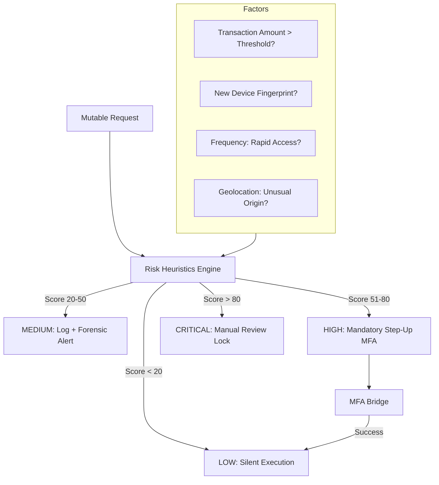

# 🔐 Behavior Risk Engine (Adaptive Security)

---

## 2. Overview
Static locks and simple passwords provide poor security against modern, human-centric attacks. NexusBank implements a **Behavior Risk Engine**—a heuristic state machine that evaluates every sensitive action based on historical patterns. Rather than a binary "Allow/Deny," the engine scales security friction (MFA, delays, or locks) in real-time, providing smooth service for regular use and fortress-grade protection during anomalies.

---

## 3. Decision Matrix Diagram



---

## 4. Threat Model
*   **Attack Prevented**: Sophisticated Account Takeover, Social Engineering, and Bot Scrapers.
*   **Scenario**: A user's laptop is stolen. The thief is able to guess the local PIN/Password. They attempt to drain the user's entire account balance (₹200,000) at 4:00 AM from a coffee shop Wi-Fi.
*   **Result**: The **Behavior Risk Engine** detects three simultaneous flags:
    1.  Amount > ₹50k (High risk).
    2.  Time of day is an outlier for this user (Anomaly).
    3.  IP/Geographic origin is new.
    The engine returns a `CRITICAL` risk score (> 80), immediately locks the account, and triggers a physical notification to the user's phone, stopping the theft before it begins.

---

## 5. Implementation Details
*   **Dynamic Weighting**: Risk scores are calculated using weighted factors (documented in `transactionService.js`).
*   **Step-Up Bridge**: High-risk scores don't automatically fail; they challenge the user to provide higher-authority proof (MFA).
*   **Forensic Shadowing**: All risk scoring decisions are saved in `security_events` metadata, allowing for fine-tuning of the "Sensitivity" dial by admins (Doc 19).

---

## 6. Code Snippets

### Backend: The Weighted Risk Algorithm
```js
// server/services/riskEngine.js
class RiskEngine {
  async calculateScore(user, body, metadata) {
    let score = 0;

    // 1. Value Heuristic
    if (body.amount > 50000) score += 40;
    if (body.amount > 100000) score += 30; // Compounding risk

    // 2. Identity Heuristic
    if (metadata.isNewDevice) score += 30;

    // 3. Velocity Heuristic (Rapid fire attempts)
    const recentTxns = await getRecentTxnFrequency(user.id);
    if (recentTxns > 5) score += 50;

    // 4. State Decision
    return {
       score,
       action: this.getRecommendedAction(score)
    };
  }

  getRecommendedAction(score) {
    if (score > 80) return 'LOCK_ACCOUNT';
    if (score > 50) return 'REQUIRE_MFA';
    if (score > 20) return 'LOG_WARNING';
    return 'ALLOW';
  }
}
```

---

## 7. Security Benefits
*   **Reduced Friction**: Low-risk users enjoy a seamless UI.
*   **Proactive Defense**: Identifies patterns of theft before they are completed.
- **Explainable Decisions**: Admins can see exactly *why* a transaction was blocked (e.g., "Score: 75: High Amount + New Device").

---

## 8. Limitations / Notes
*   **Cold Starts**: New users have no baseline, so they may trigger more "False Positives" initially.
*   **Privacy**: Requires tracking IP and device metadata for effective comparison.

---

## 9. Summary
The Behavior Risk Engine transforms NexusBank's security from a "Passport Check" into "Intelligence-Led Policing," ensuring that protection is always scaled to the actual threat level of the moment.
