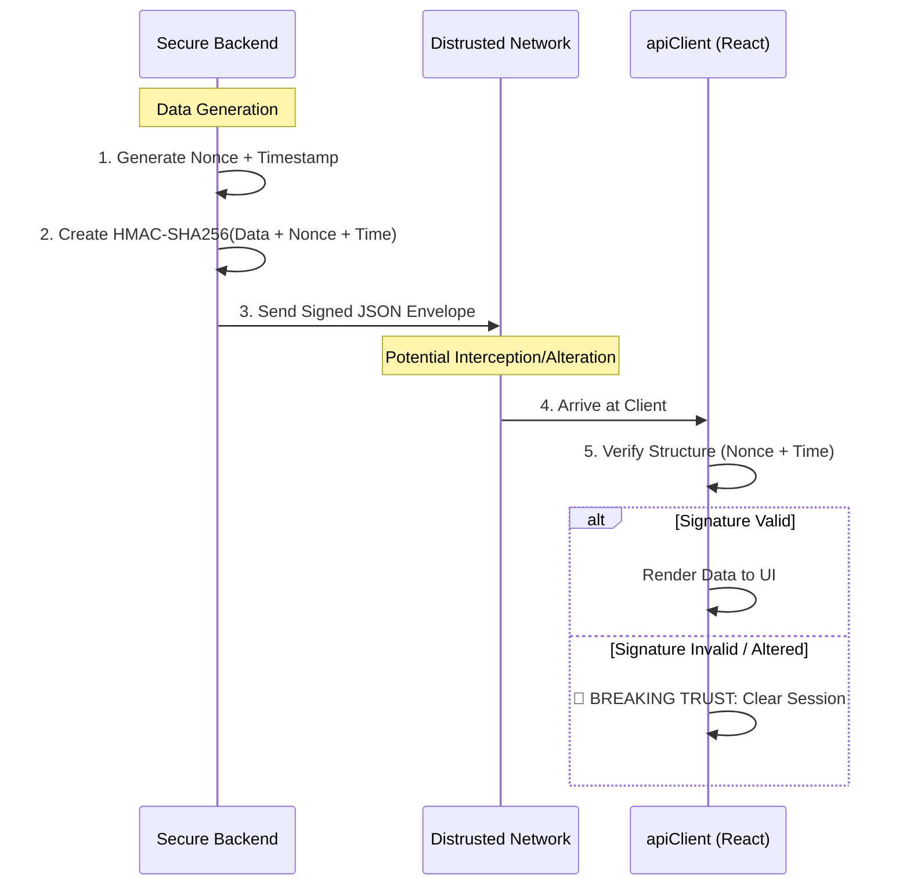

# 🔐 API Response Signing (Anti-Tampering)

---

## 2. Overview
Zero-Trust is not only about securing incoming requests; it is equally about securing outgoing data. NexusBank implements **API Response Signing**, where the backend cryptographically signs every JSON payload. This ensures that a Man-in-the-Middle (MITM) attacker or malicous proxy cannot modify the data being displayed to the user (e.g., hiding a fraudulent transaction or faking an account balance).

---

## 3. Communication Diagram



---

## 4. Threat Model
*   **Attack Prevented**: Post-Response Tampering and Malicious UI Injection.
*   **Scenario**: Attacker B intercepts the user's dashboard response. They modified the JSON to hide a ₹10,000 withdrawal they just made, making the user believe their balance is higher than it actually is.
*   **Result**: The frontend's `apiClient` receives the JSON. It detects that the data has been altered because the provided `signature` does not match the content of the `data` field. The frontend immediately triggers a `handleSecurityFailure()`, preventing the user from being misled and logging out the session.

---

## 5. Implementation Details
*   **Envelope Pattern**: The actual financial data is wrapped in a "Handshake Envelope" containing the signature and freshness metadata.
*   **Central Signing**: Handled by a global Express middleware to ensure 100% coverage of all API responses.
*   **Dynamic Secrets**: The `RESPONSE_SECRET` is synchronized with the frontend's expected structural validation rules.

---

## 6. Code Snippets

### Backend: Automated Signing Middleware
```js
// server/index.js
const crypto = require('crypto');

app.use((req, res, next) => {
    const originalJson = res.json;

    res.json = function (data) {
        const payload = {
            data,
            timestamp: Date.now(),
            nonce: crypto.randomUUID(),
        };

        // Cryptographically sign the envelope
        const signature = crypto
            .createHmac('sha256', process.env.RESPONSE_SECRET)
            .update(JSON.stringify(payload))
            .digest('hex');

        // Send the signed bundle
        return originalJson.call(this, {
            ...payload,
            signature
        });
    };
    next();
});
```

---

## 7. Security Benefits
*   **Trust Calibration**: The user only sees what the backend explicitly verified and sent.
*   **Anti-Replay**: The signed `timestamp` ensures the browser isn't replaying an old cached balance.
- **MITM Resistance**: Makes it impossible for proxy servers to quietly alter the application's state.

---

## 8. Limitations / Notes
*   **CPU Overhead**: Stringifying and signing every response adds minor latency (ms).
*   **Browser Storage**: Does not prevent an attacker with full OS-level access from reading the data from system memory.

---

## 9. Summary
API Response Signing completes the Zero-Trust loop, ensuring that the "Bridge of Truth" between the backend logic and the user's screen is always cryptographically locked.
