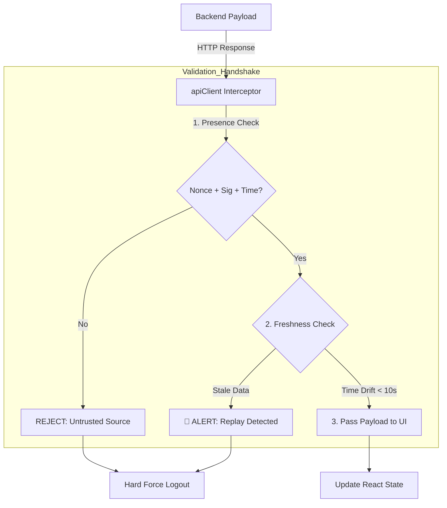

# 🔐 Frontend Zero-Trust Validation

---

## 2. Overview
In a Zero-Trust architecture, the frontend is considered an **Untrusted Territory**. NexusBank's frontend does not perform high-authority actions or hold master secrets. Instead, it acts as a **Strict Structural Validator**. It receives signed response envelopes from the backend and verifies their structure and freshness before allowing any data to reach the React component layer.

---

## 3. Trust Verification Diagram



---

## 4. Threat Model
*   **Attack Prevented**: Malicious UI Spoofing and Response Replay.
*   **Scenario**: An attacker uses a proxy tool to capture a valid "Success" message from a previous transaction. They replay this old message to the browser to make the user believe a fraudulent transaction was successfully reversed.
*   **Result**: The `apiClient` checks the `timestamp` in the replayed message. Since it is older than 10 seconds, the client identifies it as "Stale Data," refuses to render it, and triggers a `handleSecurityFailure()` event, protecting the user from being deceived.

---

## 5. Implementation Details
*   **Secret-Free Client**: The frontend bundle has no symmetric secrets. Validation is based on structural rules and relative time.
*   **Structural Fail-Closed**: If a response is missing even a single security metadata field (e.g., the `nonce`), the client terminates the entire user session.
*   **Continuous Vetting**: Every `GET`, `POST`, and `DELETE` response is passed through the same validation sieve.

---

## 6. Code Snippets

### Frontend: The Response Interceptor
```js
// src/lib/apiClient.js
const API_TRUST_WINDOW = 10000; // 10 Seconds

const validateResponse = (envelope) => {
    const { data, timestamp, nonce, signature } = envelope;

    // 1. Mandatory Structural Check
    if (!signature || !nonce || !timestamp) {
        throw new SecurityError('UNTRUSTED_HANDSHAKE_MISSING');
    }

    // 2. Freshness Check (Anti-Replay)
    const now = Date.now();
    const drift = Math.abs(now - timestamp);
    
    if (drift > API_TRUST_WINDOW) {
        logger.error('STALE_DATA_INTERCEPTED', { drift });
        throw new SecurityError('REPLAY_PROTECTION_TRIGGERED');
    }

    // 3. Return payload to the calling component
    return data;
};
```

---

## 7. Security Benefits
*   **Zero Leakage Risk**: Since the client doesn't hold keys, there is no value in reverse-engineering the JS bundle.
*   **Deterministic UI**: Components only know about "Verified" data.
- **Improved UX Stability**: Prevents the UI from acting on stale or out-of-sync network states.

---

## 8. Limitations / Notes
*   **Trust Dependence**: The client blindly trusts that if the structure is correct and fresh, the backend has signed it (Backend-as-Authority).
*   **Clock Sync**: Users with manual system clocks that are off by >10s will be unable to use the app.

---

## 9. Summary
Frontend Zero-Trust Validation ensures that the user's browser is not just a viewer, but a vigilant validator. It acts as the final gatekeeper that prevents tampered or stale information from reaching the user's eyes.
