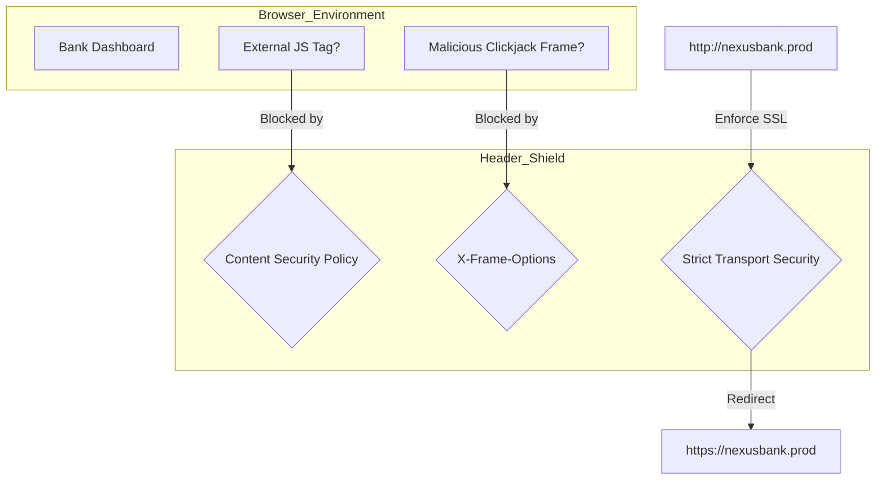

# 🔐 CSP, HSTS & Security Headers (Hardening)

---

## 2. Overview
Modern browsers are powerful but can be weaponized against users through code injection. NexusBank uses **Security Headers** to force the browser into a "Locked" state. By implementing strict **Content Security Policy (CSP)** and **HSTS**, we ensure that the browser only executes authorized code and only connects over encrypted, non-downgradable channels.

---

## 3. Browser Hardening Diagram



---

## 4. Threat Model
*   **Attack Prevented**: Cross-Site Scripting (XSS), Clickjacking, and Protocol Downgrade (SSL Stripping).
*   **Scenario (XSS)**: An attacker finds a way to inject a `<script>` tag into a user's profile view that steals their session cookie and sends it to `evil-server.com`.
*   **Result**: The browser receives the strict CSP header from the NexusBank server. It identifies that `evil-server.com` is not in the `connect-src` whitelist. The browser blocks the XSS script from executing and sends a violation report to the bank's security team.

---

## 5. Implementation Details
*   **Helmet.js Middleware**: Centralizes header management in the Express server.
*   **Strict CSP Rules**:
    - `default-src 'self'`: Disallows all resources not originating from our own domain.
    - `object-src 'none'`: Disallows legacy plugins (Flash, Silverlight).
    - `frame-ancestors 'none'`: Prevents the site from being rendered inside an iframe anywhere else.
*   **HSTS Enforcement**: Sets a `max-age` of 1 year, ensuring that even if the user types `http://`, the browser automatically upgrades to `https://`.

---

## 6. Code Snippets

### Backend: Consolidate Security Headers
```js
// server/middleware/securityHeaders.js
const helmet = require('helmet');

const securityHeaders = helmet({
    contentSecurityPolicy: {
        directives: {
            defaultSrc: ["'self'"],
            scriptSrc: ["'self'"], // Block ALL inline and external scripts
            connectSrc: ["'self'", "https://*.supabase.co"], // Only let browser talk to us + DB
            imgSrc: ["'self'", "data:", "https://images.unsplash.com"],
            styleSrc: ["'self'", "'unsafe-inline'"], // Allow CSS
            objectSrc: ["'none'"],
            upgradeInsecureRequests: [],
        },
    },
    hsts: {
        maxAge: 31536000,   // 1 Year
        includeSubDomains: true,
        preload: true        // Listed in browser HSTS preload lists
    },
    xFrameOptions: { action: 'deny' }, // Anti-Clickjacking
});
```

---

## 7. Security Benefits
*   **Attack Class Neutralization**: Solves XSS infrastructure-wide without changing individual components.
*   **Encryption Persistence**: Ensures that no sensitive data is ever transmitted in plain text.
- **Brand Protection**: Prevents malicious actors from "framing" the bank website to trick users.

---

## 8. Limitations / Notes
*   Strict CSP can be difficult to manage if the app requires many external integrations (e.g., analytics, maps).
*   Misconfigured CSP can "break" CSS or JS, leading to an unusable UI for genuine users.

---

## 9. Summary
Security Headers are the "Body Armor" of the NexusBank browser environment. They ensure that even if an attacker finds a way to inject content, the browser's own security engine will refuse to act on it.
