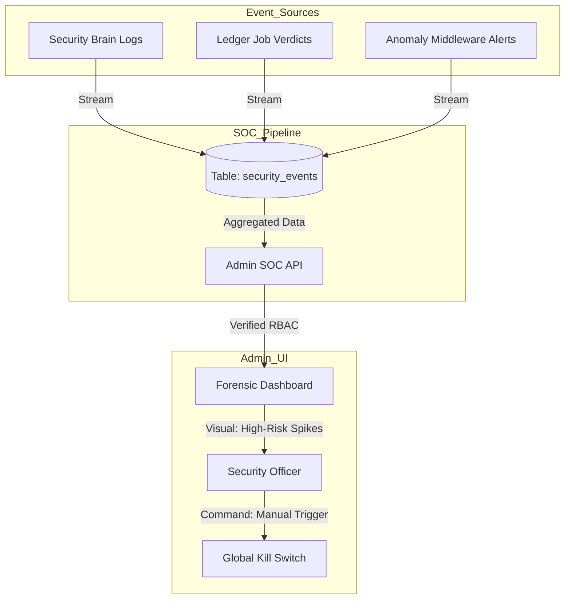

# 🔐 Admin Security Dashboard (Forensic SOC)

---

## 2. Overview
Visibility is the cornerstone of rapid incident response. NexusBank provides security administrators with a dedicated **Security Operations Center (SOC) Dashboard**. This real-time interface provides forensic surveillance of system heartbeat, anomaly events, and cryptographic failures across the platform, enabling human investigators to oversee the automated Zero-Trust defenses.

---

## 3. Operations Diagram



---

## 4. Threat Model
*   **Attack Prevented**: Delayed Detection of Distributed Stealth Attacks.
*   **Scenario (Low-and-Slow Attack)**: An attacker uses 50 different IP addresses to attempt single fraudulent transactions over several hours. Individually, these don't trigger the general rate limits.
*   **Result**: The **Admin Dashboard** aggregates these "Signature Failures" across the system. The admin sees a systemic rise in `MEDIUM` severity events targeting specific merchant accounts. The dashboard's "Heatmap" reveals the coordinate attack, allowing the admin to trigger a proactive block before a major loss occurs.

---

## 5. Implementation Details
*   **Forensic Severity Tiers**: Events are categorized as LOW (Info), MEDIUM (Anomaly), HIGH (Identity Breach), and CRITICAL (Ledger Drift).
*   **RBAC Protected View**: The frontend uses `adminAuth` to ensure that standard users or regular staff cannot view forensic logs.
- **State Surveillance**: Displays the live status of the **Kill Switch (Doc 10)** and the results of the latest **Shadow Ledger Reconciliation (Doc 12)**.

---

## 6. Code Snippets

### Backend: Admin Forensic Route
```js
// server/routes/admin.js
router.get('/security/events', adminAuth, async (req, res) => {
    // 1. Fetch forensic timeline with metadata
    const { data: events, error } = await supabaseAdmin
        .from('security_events')
        .select('*')
        .order('created_at', { ascending: false })
        .limit(100);

    // 2. Fetch system heartbeat
    const { data: config } = await supabaseAdmin
        .from('system_config')
        .select('value')
        .eq('key', 'system_lock')
        .single();

    res.json({
        events,
        isLocked: config?.value?.active || false,
        lockReason: config?.value?.reason
    });
});
```

### Frontend: SOC Surveillance UI
```jsx
// src/pages/AdminSecurity.jsx
export default function AdminSecurity() {
  const [events, setEvents] = useState([]);
  const { user } = useAuth();

  // Strict RBAC Guard at the Component level
  if (user?.role !== 'admin') return <Unauthorized />;

  return (
    <div className="admin-grid">
      <Stats Summary />
      <div className="log-panel">
        <EventTable data={events} /> {/* Color coded by severity */}
      </div>
      <EmergencyControls /> {/* Kill Switch Handlers */}
    </div>
  );
}
```

---

## 7. Security Benefits
*   **Situational Awareness**: Provides a unified view of the bank's security posture.
*   **Auditability**: Maintains a record of every security failure for regulatory review.
- **Incident Response Efficiency**: Reduces "Mean Time to Detect" (MTTD) by surfacing anomalies in real-time.

---

## 8. Limitations / Notes
*   **Alert Fatigue**: Admins must tune severity thresholds to avoid being overwhelmed by noise.
*   **Dashboard Security**: The SOC is itself a high-value target; it must be protected with the strictest MFA (Doc 06).

---

## 9. Summary
The Admin Security Dashboard is the "Nervous System" of NexusBank. It combines automated cryptographic alerts with human oversight, ensuring that the platform's defenses are always visible and actionable.
