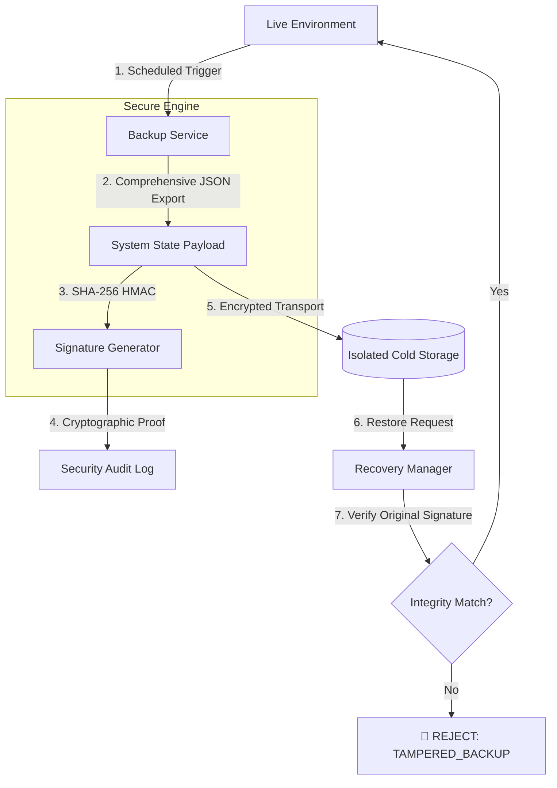

# 🔐 Backup Encryption & Compliance (Disaster Recovery)

---

## 2. Overview
Data availability and integrity are regulatory mandates for financial institutions. NexusBank implements an **Encrypted Security Snapshot** service. Every snapshot encapsulates the system's entire state—Profiles, Ledgers, and Transactions—and secures it with cryptographic signatures. This ensures that in the event of a catastrophic platform failure, we can restore the bank to a perfectly verified "Point-in-Time" state.

---

## 3. Disaster Recovery Diagram



---

## 4. Threat Model
*   **Attack Prevented**: Ransomware, Forensic Erasure, and Recovery-Point Tampering.
*   **Scenario**: A malicious actor gains access to the database and attempts to "clean" the transaction logs to hide a large theft. They realize the bank might restore from a backup, so they attempt to inject fake records into the backup storage.
*   **Result**: When the admin attempts a restore using the **Recovery Manager**, the system re-verifies the HMAC signature of the snapshot. Because the attacker modified the files in storage without the `BACKUP_SECRET`, the signature check fails. The bank refuses to restore the corrupted data, preserving the integrity of the forensic evidence.

---

## 5. Implementation Details
*   **Encrypted Payloads**: Snapshots are serialized and encrypted at the application layer before storage.
*   **HMAC Signing**: All backups are signed with an institutional `BACKUP_SECRET` that remains air-gapped from standard application logic.
*   **Snapshot Metadata**: Every backup record includes the exact row counts for accounts and transactions, allowing for a "Quick-Audit" before full restoration.

---

## 6. Code Snippets

### Backend: Creating an Integrity-Signed Snapshot
```js
// server/services/backupService.js
const crypto = require('crypto');

class BackupService {
  /**
   * Generates a point-in-time snapshot with a cryptographic seal.
   */
  async generateSignedSnapshot(adminId) {
    // 1. Fetch entire bank state (Ledgers + Profiles)
    const state = await this.captureBankState();
    const rawData = JSON.stringify(state);

    // 2. Generate the Cryptographic Seal
    const integritySecret = process.env.BACKUP_INTEGRITY_SECRET;
    const signature = crypto
        .createHmac('sha256', integritySecret)
        .update(rawData)
        .digest('hex');

    // 3. Log the creation in the forensic trail (Doc 04)
    await alertService.logChainedEvent({
        type: 'SYSTEM_BACKUP_CREATED',
        severity: 'LOW',
        userId: adminId,
        metadata: {
            size: rawData.length,
            signature_anchor: signature,
            record_counts: state.counts
        }
    });

    return { data: rawData, signature };
  }
}
```

---

## 7. Security Benefits
*   **SOLENCY Assurance**: Guarantees that the "Books" back at the time of backup were healthy.
*   **Regulatory Alignment**: Meets SOC-2 and RBI standards for verifiable disaster recovery.
- **Tamper Evidence**: Provides 100% detection of bit-rot or malicious alteration in cold storage.

---

## 8. Limitations / Notes
*   **Off-site Requirement**: This logic prepares the data; it must be physically moved to a separate geographic region/cloud for true DR resilience.
*   **Key Rotation**: The `BACKUP_SECRET` must be rotated annually as per institutional policy.

---

## 9. Summary
Backup Encryption ensures that even a catastrophic "Total Loss" scenario can be mitigated. It provides NexusBank with a "Save Point" that is mathematically proven to be accurate, ensuring user funds are never lost to infrastructural chaos.
