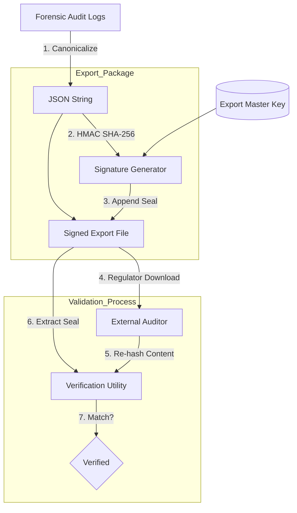

# 🔐 Audit Export Signing (Non-Repudiation)

---

## 2. Overview
Financial regulators require that system logs are not only accurate but **Provably Original**. NexusBank implements **Audit Export Signing**, where every forensic JSON export is cryptographically sealed by the backend. This ensures that the data has not been modified after leaving the bank's secure environment, providing non-repudiation for institutional oversight.

---

## 3. Trust Seal Diagram



---

## 4. Threat Model
*   **Attack Prevented**: Post-incident Evidence Tampering and Verification Fraud.
*   **Scenario (Evidence Scrubbing)**: An attacker gains access to a security officer's laptop and modifies a downloaded audit export to remove the record of their IP address.
*   **Result**: When the regulator runs the bank's **Verification Utility** on the file, the utility re-calculates the HMAC of the file's content using the institutional `EXPORT_SECRET`. Because the attacker modified even one character in the JSON, the signature check fails. The file is rejected as "UNSECURE / MODIFIED," preserving the integrity of the forensic investigation.

---

## 5. Implementation Details
*   **Institutional Secret**: Signing is performed using a dedicated `EXPORT_SECRET` stored in a secure backend environment.
*   **Signature Envelope**: The final export file is a JSON object containing the `data` (original logs) and the `signature` (the seal).
- **Format Stability**: The export logic ensures stable key ordering to guarantee the signature is reproducible by authorized auditors.

---

## 6. Code Snippets

### Backend: Sealing the Forensic Export
```js
// server/services/adminService.js
const crypto = require('crypto');

async function createSignedAuditExport() {
  // 1. Fetch Forensic state
  const { data: logs } = await supabaseAdmin
    .from('security_events')
    .select('created_at, type, severity, user_id, metadata');
  
  const payload = JSON.stringify(logs);

  // 2. Generate the Cryptographic Seal
  const signature = crypto
    .createHmac('sha256', process.env.AUDIT_EXPORT_SECRET)
    .update(payload)
    .digest('hex');

  // 3. Return the sealed bundle
  return {
    version: "v1.0",
    generated_at: new Date().toISOString(),
    logs,
    signature // The non-repudiation seal
  };
}
```

---

## 7. Security Benefits
*   **Institutional Trust**: Provides regulators with a mathematical guarantee of data origin.
*   **Integrity Assurance**: Protects logs from mutation during transit or storage on unencrypted office devices.
- **Forensic Continuity**: Maintains the chain of custody from the database to the courtroom.

---

## 8. Limitations / Notes
*   **Root of Trust**: The system assumes the backend key remained secure during the signature generation process.
*   **External Verification**: Only auditors with the corresponding institutional keys can verify the seal.

---

## 9. Summary
Audit Export Signing ensures that NexusBank's history is an unalterable record of truth, providing the high-assurance evidence required for modern financial accountability.
