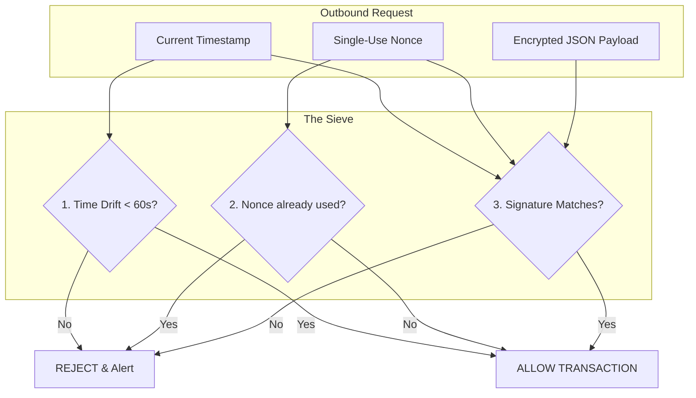

# 🔐 Replay Attack Prevention (Anti-Temporal Theft)

---

## 2. Overview
A "Replay Attack" involves capturing a valid encrypted message and resubmitting it later to trick the server into performing a duplicate action (e.g., repeating a Withdrawal). NexusBank's Zero-Trust architecture makes this impossible through **Multi-Variable Freshness Enforcement**. We bind every request to a specific **60-second time window** and a **unique single-use identifier (Nonce)**.

---

## 3. Freshness Verification Diagram



---

## 4. Threat Model
*   **Attack Prevented**: Transaction Duplication and Delayed Signal Injection.
*   **Scenario (Interception)**: An attacker intercepts a legitimate "Pay ₹5,000" packet from a user on public Wi-Fi. Ten minutes later, they resubmit the packet.
*   **Result**: 
    1.  The **Security Brain** extracts the `timestamp`. It detects that the difference between `Now` and `CapturedTime` is 600 seconds (outside the 60s window).
    2.  The request is immediately discarded as "STALE," even if the signature is perfectly valid. The attacker cannot "refresh" the timestamp without generating a new signature, which requires the backend secret they don't have.

---

## 5. Implementation Details
*   **Drift Tolerance**: Compensates for small network delays by allowing a +/-60 second window.
*   **Nonce Consumption**: Works in tandem with the timestamp. The nonce prevents duplicate clicks *within* the 60s window, while the timestamp prevents replaying them *outside* the window.
*   **Global Enforcement**: Applied at the proxy middleware level before any business logic is executed.

---

## 6. Code Snippets

### Backend: The Freshness Validator
```js
// server/middleware/freshness.js
const REPLAY_WINDOW_MS = 60000; // 60 Seconds

const verifyFreshness = (req, res, next) => {
    const { timestamp, nonce } = req.body;

    // 1. Check for absolute presence
    if (!timestamp || !nonce) {
        return res.status(403).json({ error: 'Freshness Metadata Required' });
    }

    // 2. Validate Drift Window
    const serverTime = Date.now();
    const drift = Math.abs(serverTime - timestamp);

    if (drift > REPLAY_WINDOW_MS) {
        logger.warn('REPLAY_ATTEMPT_DETECTED: STALE_TIMESTAMP', { 
            ip: req.ip, 
            driftSeconds: drift / 1000 
        });
        return res.status(403).json({ error: 'Request Expired' });
    }

    // Next step: verifyNonce(nonce) (Doc 24)
    next();
};
```

---

## 7. Security Benefits
*   **Temporal Hardening**: Limits the window of opportunity for an attacker to use a captured signal.
*   **Deterministic State**: Ensures that the ledger state is updated only for "Live" user intents.
- **Improved Anomaly Detection**: Provides a high-fidelity signal for identifying active network tap attacks.

---

## 8. Limitations / Notes
*   **Clock Sync**: Requires the server and client to have relatively synchronized system clocks (NTP).
*   **One-Way Freshness**: Only protects against replaying the *client request*, not a *server response* (handled separately via Doc 14).

---

## 9. Summary
Replay Attack Prevention is the "Security Guard" of NexusBank's time-space domain. It ensures that every request is not only valid but is arriving in the correct "Now," making intercepted signals mathematically useless to attackers.
