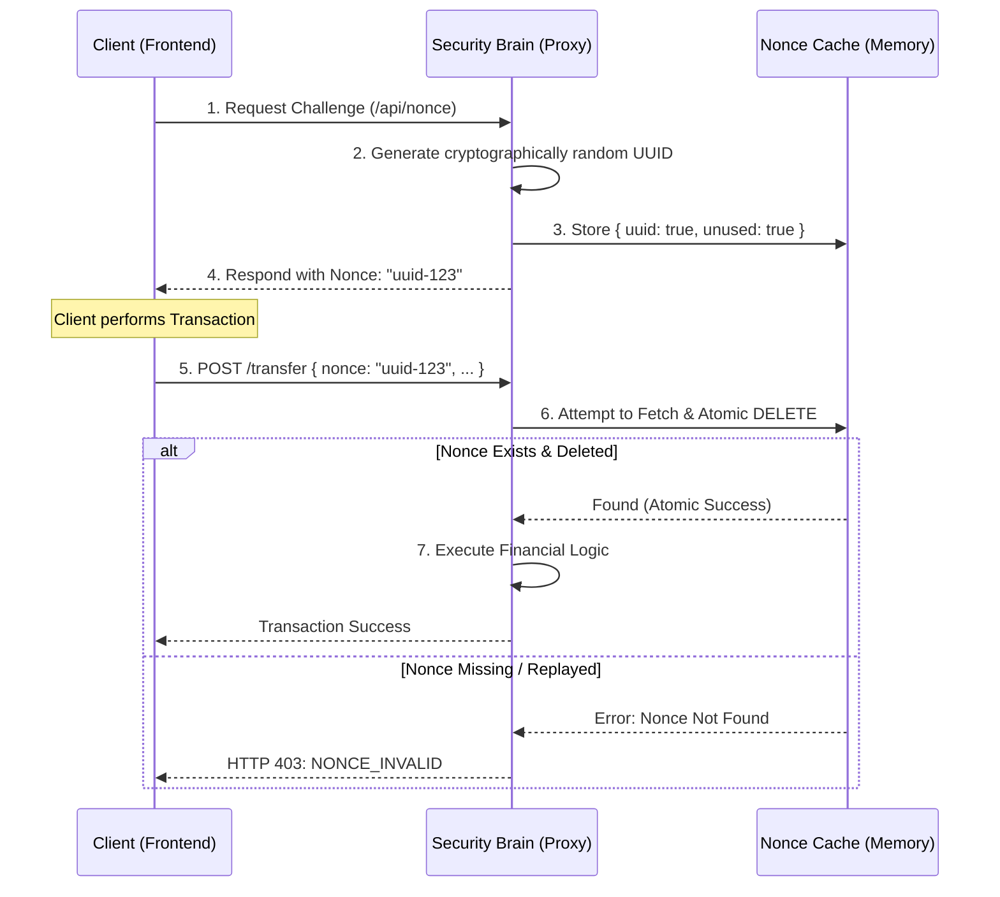

# 🔐 Nonce Management System (Challenge/Response)

---

## 2. Overview
A **Nonce** (Number Used Once) is a unique, cryptographically random token that ensures a transaction cannot be re-executed. NexusBank uses a **Challenge-Response** lifecycle for nonces. These are never generated by the client (to prevent predictable sequences) but are issued by the server and immediately "burned" after a single successful operation.

---

## 3. Nonce Lifecycle Diagram



---

## 4. Threat Model
*   **Attack Prevented**: Intent Spoofing and Automated Flooding.
*   **Scenario (Flash-Attack)**: An attacker writes a script to send 1,000 "Check Balance" requests per second.
*   **Result**: To make these requests, the script must first call the `/nonce` endpoint for every single attempt. This **Challenge Handshake** creates a natural bottleneck that allows the bank's **Rate Limiter (Doc 02)** to easily identify and block the automated script before it consumes significant database resources.

---

## 5. Implementation Details
*   **Cryptographic Entropy**: Nonces are generated using `crypto.randomUUID()`.
*   **Atomic Consumption**: We use a `Map` or `Set` with an atomic delete operation (`map.delete(nonce)`) to prevent race conditions where two identical nonces arrive at the same millisecond.
*   **Strict TTL**: Nonces automatically expire after 60 seconds if not consumed, ensuring the server stays clear of unused session artifacts.

---

## 6. Code Snippets

### Backend: The Nonce Authority
```js
// server/services/storeService.js
const crypto = require('crypto');

class StoreService {
    constructor() {
        this.nonceCache = new Map(); // In production, use Redis with TTL
    }

    /**
     * Issues a fresh, verifiable challenge.
     */
    generateChallenge(userId) {
        const nonce = crypto.randomUUID();
        this.nonceCache.set(nonce, { userId, createdAt: Date.now() });
        return nonce;
    }

    /**
     * Atomic verification and invalidation.
     */
    consumeNonce(nonce, expectedUserId) {
        const record = this.nonceCache.get(nonce);

        if (!record || record.userId !== expectedUserId) return false;

        // Immediately burn on use to prevent replay
        this.nonceCache.delete(nonce);
        return true;
    }
}
```

---

## 7. Security Benefits
*   **Execution Isolation**: Ensures that a "Signal" (The Request) can only be turned into an "Action" (The Transfer) exactly once.
*   **Anti-Automated**: Forces clients to perform an interactive 2-step handshake.
- **Improved Forensic ID**: Provides a unique trace ID for every single incoming request intent.

---

## 8. Limitations / Notes
*   **Handshake Overhead**: Adds one extra HTTP round-trip per mutation.
*   **Stateful Proxy**: Requires the proxy server to keep track of issued nonces (can be solved via a shared Redis cache for cluster setups).

---

## 9. Summary
The Nonce Management System is the "One-Way Gate" of NexusBank. It transforms the public web into a series of unique, verifiable, and single-use financial handshakes, making duplication and replay impossible.
