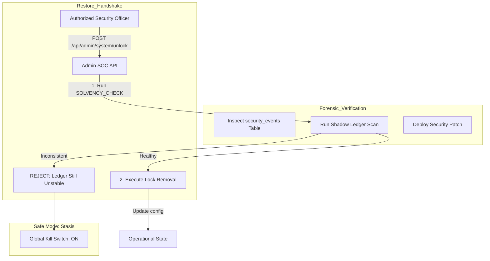

# 🔐 System Lock Recovery (Forensic Restoration)

---

## 2. Overview
Exiting a **Global Lockdown (Safe Mode)** is a high-risk operation. If the system is unlocked while the underlying vulnerability or intrusion is still active, the attacker can immediately resume their exploit. NexusBank implements a **Forensic Recovery Process** that mandates a full state-check and automated ledger reconciliation before a human administrator can manually restore operations.

---

## 3. Recovery Workflow Diagram



---

## 4. Threat Model
*   **Attack Prevented**: Exploit Resumption and Premature Restoration.
*   **Scenario (Persistent Intrusion)**: An attacker triggers a system lock to confuse the bank's admins. They hope the admin will "Quick-Unlock" the bank to resume service for customers, allowing the attacker's dormant malicious script to immediately restart its fund-draining routine.
*   **Result**: The **Recovery Manager** refuses to unlock the bank because it detects that the **Shadow Ledger (Doc 12)** is still reporting a discrepancy in total solvency. The admin is forced to investigate the logs further, discover the attacker's script, and patch the database before the "Unlock" command is physically accepted by the system.

---

## 5. Implementation Details
*   **Manual Override**: Recovery is never automated; it requires an explicit `POST` request from a verified `admin`.
*   **Solvency Prerequisite**: The `ledgerJob` must return a `SUCCESS` status before the unlock logic is even permitted to execute.
*   **Logging**: The identity of the recovery officer and the "Reason for Restoration" are cryptographically logged in the forensic chain (Doc 04).

---

## 6. Code Snippets

### Backend: The Conditional Unlock Engine
```js
// server/routes/admin.js
router.post('/system/unlock', adminAuth, async (req, res) => {
    try {
        // 1. Hard Prerequisite: Solvency Reconciliation (Doc 12)
        const isHealthy = await ledgerAudit.runReconciliation();
        if (!isHealthy) {
            return res.status(400).json({ 
                error: 'Restoration Aborted: Ledger Solvency mismatch detected.' 
            });
        }

        // 2. Clear System Lock
        await supabaseAdmin
            .from('system_config')
            .update({ 
                value: { active: false, unlocked_by: req.user.id } 
            })
            .eq('key', 'system_lock');

        // 3. Log Forensic Trail
        logger.info('SYSTEM_RESTORED_TO_OPERATIONAL', { 
            adminId: req.user.id, 
            reason: req.body.reason 
        });

        res.json({ message: 'NexusBank operational mode restored.' });
    } catch (err) {
        res.status(500).end();
    }
});
```

---

## 7. Security Benefits
*   **Deliberate Safety**: Eliminates "Panic Restoration" mistakes.
*   **Provable Stability**: Ensures that the bank ONLY restarts when the books are mathematically balanced.
- **Full Accountability**: Tethers the system's operational state to a specific human decision-maker.

---

## 8. Limitations / Notes
*   **Admin Access**: If the admin's account is also compromised, the recovery process can be abused (requires Doc 06: MFA).
*   **Time To Recovery (TTR)**: The forensic checks add time to the recovery window, prioritizing safety over speed.

---

## 9. Summary
System Lock Recovery is the "Safe Passage" back to normalcy. It ensures that NexusBank's return to operational status is a deliberate, verified, and forensically sound action, maintaining the bank's absolute commitment to data integrity.
